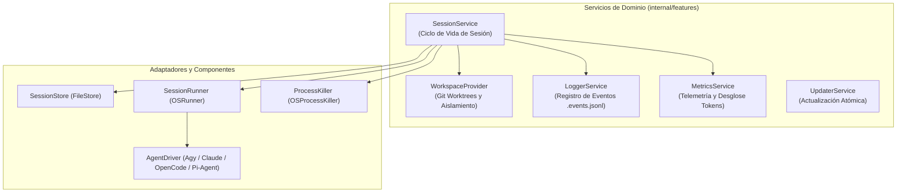
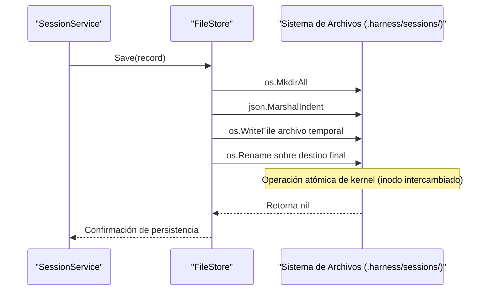
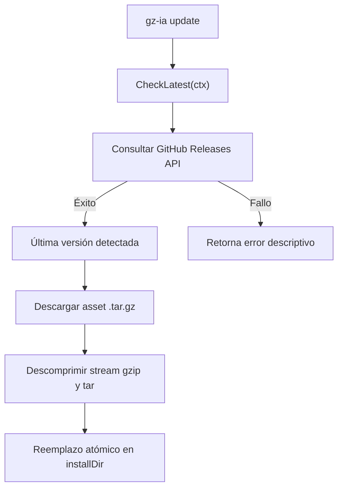

# Contratos de Servicios e Interfaces en Go

La arquitectura de `gz-ia` está diseñada bajo los principios de **Inversión de Dependencias (DIP)** y **Arquitectura Limpia (Hexagonal)**. El núcleo funcional no se acopla a las librerías de interfaz de usuario (`cli` o `tui`), a binarios externos ni a drivers específicos, sino que expone contratos de interfaz estrictos definidos en paquetes independientes bajo `internal/features/` (`internal/features`).

---

## 1. Mapa de Interfaces del Sistema



---

## 2. `features/session.Service`

El servicio de sesión es el orquestador principal del ciclo de vida de los agentes. Se encuentra implementado en `internal/features/session/service.go`.

### Definición del Contrato

```go
type Service interface {
    StartChat(ctx context.Context, req StartChatRequest) error
    List(ctx context.Context) ([]SessionRecord, error)
    GetRecord(ctx context.Context, id string) (*SessionRecord, error)
    GetSession(ctx context.Context, id string) (*SessionRecord, error)
    Get(ctx context.Context, id string, opts MergeOptions) (*workspace.MergeResult, error)
    Read(ctx context.Context, id string, statOnly bool) (string, error)
    Kill(ctx context.Context, id string) error
    Resume(ctx context.Context, id string) error
    Delete(ctx context.Context, id string) error
    Path(ctx context.Context, id string) (string, error)
    Diff(ctx context.Context, id string, statOnly bool) (string, error)
    Merge(ctx context.Context, id string, opts MergeOptions) (*workspace.MergeResult, error)
    Metrics(ctx context.Context, id string) (*metrics.SessionMetrics, error)
    LogEvent(ctx context.Context, evt *logger.Event) error
    GetEvents(ctx context.Context, id string) ([]logger.Event, error)
    WatchEvents(ctx context.Context, id string) (<-chan logger.Event, error)
}
```

### Estructuras de Petición y Opciones

```go
type StartChatRequest struct {
    ID              string
    Provider        string
    WorkingDir      string
    InitialPrompt   string
    PermissionLevel PermissionLevel
    BinaryPath      string
    OnLaunch        func(id string, isIsolated bool)
}

type MergeOptions struct {
    Squash   bool
    NoCommit bool
}
```

### Patrón Functional Options en Inicialización

`session.NewService` permite la inyección de mocks o implementaciones alternativas en entornos de pruebas y producción:

```go
func NewService(workDir string, opts ...Option) Service

// Opciones de inyección disponibles:
WithStore(s Store) Option
WithRunner(r Runner) Option
WithKiller(k ProcessKiller) Option
WithWorkspace(ws workspace.Provider) Option
WithMetrics(m metrics.Service) Option
WithLogger(l logger.Service) Option
```

---

## 3. `features/session.Store` y Persistencia Atómica

La persistencia del estado de las sesiones se administra mediante `internal/features/session/store.go`.

### Definición del Contrato

```go
type Store interface {
    Save(s *SessionRecord) error
    Get(id string) (*SessionRecord, error)
    List() ([]SessionRecord, error)
    Delete(id string) error
}
```

### Modelo de Datos `SessionRecord`

```go
type SessionRecord struct {
    ID              string          `json:"id"`
    PID             int             `json:"pid"`
    Provider        string          `json:"provider"`
    Status          SessionStatus   `json:"status"` // running, completed, failed, killed
    PermissionLevel PermissionLevel `json:"permission_level"` // readonly, supervised, autonomous
    WorkingDir      string          `json:"working_dir"`
    InitialPrompt   string          `json:"initial_prompt,omitempty"`
    StartedAt       time.Time       `json:"started_at"`
    FinishedAt      *time.Time      `json:"finished_at,omitempty"`
    DurationMs      int64           `json:"duration_ms,omitempty"`
    ExitCode        int             `json:"exit_code"`
    IsIsolated      bool            `json:"is_isolated"`
    WorktreeDir     string          `json:"worktree_dir,omitempty"`
    BranchName      string          `json:"branch_name,omitempty"`
}
```

### Mecanismo de Escritura Atómica en Disco

Para prevenir estados inconsistentes ante fallos de alimentación, interrupciones `SIGKILL` o lecturas concurrentes, `FileStore` implementa un patrón de escritura en archivo temporal y renombrado atómico soportado por el kernel Linux:



---

## 4. `features/session.Runner` & `OSRunner` (TTY y Señales POSIX)

Ubicado en `internal/features/session/session.go` y `internal/features/session/killer.go`.

### Contratos de Ejecución y Terminación

```go
type Runner interface {
    Run(ctx context.Context, binary string, args []string, dir string, onStart func(pid int)) (exitCode int, err error)
}

type ProcessKiller interface {
    Kill(pid int) error
}
```

### Conexión Interactiva de TTY y Callback de PID

`OSRunner` realiza el amarre físico de la terminal del usuario con el proceso agéntico hijo:

```go
func (r *OSRunner) Run(ctx context.Context, binary string, args []string, dir string, onStart func(pid int)) (int, error) {
    binPath, err := ResolveBinaryPath(binary)
    if err != nil {
        return -1, err
    }

    cmd := exec.CommandContext(ctx, binPath, args...)
    cmd.Dir = dir
    cmd.Stdin = os.Stdin
    cmd.Stdout = os.Stdout
    cmd.Stderr = os.Stderr

    if err := cmd.Start(); err != nil {
        return -1, err
    }

    // Notificación inmediata del PID para actualización atómica en el Store
    if onStart != nil && cmd.Process != nil {
        onStart(cmd.Process.Pid)
    }

    waitErr := cmd.Wait()
    // Captura fiel del código de salida POSIX
    exitCode := 0
    if waitErr != nil {
        var exitError *exec.ExitError
        if errors.As(waitErr, &exitError) {
            exitCode = exitError.ExitCode()
        } else {
            exitCode = 1
        }
    }
    return exitCode, waitErr
}
```

### `OSProcessKiller`: Secuencia Gradual `SIGTERM` $\to$ `SIGKILL`

```go
func (k *OSProcessKiller) Kill(pid int) error {
    proc, _ := os.FindProcess(pid)
    // 1. Verificación de Liveness
    if err := proc.Signal(syscall.Signal(0)); err != nil {
        return fmt.Errorf("el proceso con PID %d ya no se encuentra en ejecución", pid)
    }
    // 2. Envío de señal de parada ordenada
    _ = proc.Signal(syscall.SIGTERM)
    time.Sleep(100 * time.Millisecond) // Periodo de gracia
    // 3. Forzado definitivo si no ha terminado
    if err := proc.Signal(syscall.Signal(0)); err == nil {
        _ = proc.Kill() // SIGKILL
    }
    return nil
}
```

---

## 5. `features/session.Driver` (Multi-Driver Agéntico)

Ubicado en `internal/features/session/driver.go`.

### Contrato de la Interfaz

```go
type Driver interface {
    ID() string
    DisplayName() string
    BinaryName() string
    IsAvailable() bool
    InstallHint() string
    BuildArgs(cfg Config) ([]string, error)
}
```

### Matriz de Mapeo de Flags por Proveedor

| Driver | `readonly` | `supervised` *(default)* | `autonomous` | Reanudación (`Resume: true`) | Prompt Inicial (`InitialPrompt`) |
| :--- | :--- | :--- | :--- | :--- | :--- |
| **`agy`** (Google Antigravity) | `--mode plan` | *(sin flags adicionales)* | `--dangerously-skip-permissions` | `--continue` | `-i <prompt>` |
| **`claude`** (Claude Code) | *(modo interactivo estándar)* | *(modo interactivo estándar)* | `--dangerously-skip-permissions` | `--resume` | `-p <prompt>` |
| **`opencode`** (OpenCode) | *(modo interactivo estándar)* | *(modo interactivo estándar)* | `--dangerously-skip-permissions` | `--continue` | `<prompt>` *(posicional)* |
| **`pi-agent`** (Pi Agent) | *(modo interactivo estándar)* | *(modo interactivo estándar)* | `--dangerously-skip-permissions` | `--resume` | `-p <prompt>` |

### Registro Dinámico de Proveedores

- `ListDrivers() []Driver`: Retorna la lista inmutable de drivers soportados.
- `GetDriver(id string) (Driver, error)`: Resuelve el driver por ID; si el parámetro está vacío, asume `"agy"`.
- `FirstAvailableDriver() Driver`: Itera el registro y selecciona el primer agente cuyo ejecutable esté disponible en `$PATH`.

---

## 6. `features/workspace.Provider` & `GitClient`

Ubicado en `internal/features/workspace/workspace.go`.

### Definición de Contratos

```go
type GitClient interface {
    LookPath() (string, error)
    Run(ctx context.Context, dir string, args ...string) (string, error)
}

type Provider interface {
    IsGitAvailable(ctx context.Context, dir string) bool
    ResolveProjectRoot(ctx context.Context, dir string) string
    Prepare(ctx context.Context, sessionID string, baseDir string) (*Workspace, error)
    Cleanup(ctx context.Context, ws *Workspace) error
    CleanupWorktree(ctx context.Context, baseDir string, worktreeDir string, branchName string) error
    DiffWorktree(ctx context.Context, baseDir string, worktreeDir string, branchName string, statOnly bool) (string, error)
    MergeWorktree(ctx context.Context, sessionID string, baseDir string, worktreeDir string, branchName string, squash bool, noCommit bool) (*MergeResult, error)
}
```

### Flujo de Aprovisionamiento y Resolución de Raíz

1. **`ResolveProjectRoot`:** Ejecuta `git rev-parse --show-toplevel`. Si se invoca la CLI dentro de un subdirectorio profundo de un monorepo o proyecto, el arnés resuelve automáticamente el directorio raíz del repositorio para alojar las carpetas `.harness/worktrees/` y `.harness/sessions/`.
2. **`Prepare`:** Comprueba si el directorio está dentro de un repositorio Git (`git rev-parse --is-inside-work-tree`).
   - Si Git está disponible: Crea el directorio `.harness/worktrees/<sessionID>` y ejecuta `git worktree add -b harness/<sessionID> <worktreeDir>`.
   - Si no es un repositorio Git: Retorna `Workspace{IsIsolated: false, TargetDir: baseDir}` (fallback transparente sin error).

### Cálculo de Diffs con Detección de Untracked Files

Al ejecutar `DiffWorktree`:
1. Resuelve la base de comparación con `git merge-base HEAD harness/<sessionID>`.
2. Si existen archivos nuevos sin seguir en Git (`untracked`, marcados con `??` en `git status --porcelain`), ejecuta temporalmente `git add -N -- <file>` para que formen parte del diff estándar, y los restaura inmediatamente después con `git reset -q`.

### Integración Atómica y Commits Automáticos de Seguridad

Al ejecutar `MergeWorktree`:
1. **Safety Commit:** Si en el worktree del agente quedaron cambios pendientes sin comitear, `gz-ia` ejecuta automáticamente `git add -A` y comitea los cambios en la rama del worktree con el mensaje `harness(<sessionID>): session changes`. Si el entorno carece de `user.name` o `user.email`, efectúa fallback transparente con banderas de configuración en línea (`-c user.name=gz-ia -c user.email=gz-ia@localhost`).
2. **Fusión en la Rama Base:** Ejecuta el merge según las opciones (`squash`, `noCommit` o merge commit regular).

---

## 7. `features/logger.Service` & `Store` (Observabilidad de Eventos)

Ubicado en `internal/features/logger/model.go`, `store.go` (`internal/features/logger/store.go`) y `service.go` (`internal/features/logger/service.go`).

### Definición de Contratos

```go
type Store interface {
    Append(sessionID string, evt *Event) error
    ReadEvents(sessionID string) ([]Event, error)
    EventFilePath(sessionID string) string
}

type Service interface {
    Emit(ctx context.Context, evt *Event) error
    GetEvents(ctx context.Context, sessionID string) ([]Event, error)
    Watch(ctx context.Context, sessionID string) (<-chan Event, error)
}
```

### Modelo de Evento (`Event`)

```go
type Stage string
const (
    StageRead    Stage = "READ"
    StagePending Stage = "PENDING"
    StageFinish  Stage = "FINISH"
)

type Status string
const (
    StatusOK     Status = "OK"
    StatusFailed Status = "FAILED"
)

type Event struct {
    ID         string         `json:"id"`
    SessionID  string         `json:"session_id"`
    AgentID    string         `json:"agent_id,omitempty"`
    Role       string         `json:"role,omitempty"`
    Action     string         `json:"action"`
    Stage      Stage          `json:"stage"`
    Status     *Status        `json:"status"` // Exactly null, "OK" o "FAILED"
    Timestamp  time.Time      `json:"timestamp"`
    DurationMs *int64         `json:"duration_ms,omitempty"`
    Error      string         `json:"error,omitempty"`
    Metadata   map[string]any `json:"metadata,omitempty"`
}
```

### Concurrencia Thread-Safe y Transmisión en Tiempo Real (`Watch`)

- **Persistencia Append-Only:** `logger.FileStore` sincroniza escrituras concurrentes mediante `sync.RWMutex`, asegurando que múltiples procesos o goroutines puedan escribir sobre `.harness/sessions/<sessionID>.events.jsonl` sin corromper líneas JSON.
- **Transmisión Fan-Out:** `Watch(ctx, sessionID)` despacha los eventos históricos y los nuevos eventos en vivo mediante canales con buffer (`chan Event, 100`) complementados por un ticker periódico de 100ms que sincroniza eventos agregados desde el disco por procesos externos.

---

## 8. `features/metrics.Service` (Telemetría de Tokens y Subagentes)

Ubicado en `internal/features/metrics/model.go`, `collector.go` (`internal/features/metrics/collector.go`) y `service.go` (`internal/features/metrics/service.go`).

### Definición de Contratos

```go
type Service interface {
    GetMetrics(ctx context.Context, sessionID string, workDir string) (*SessionMetrics, error)
}
```

### Heurística de Tokens y Desglose Analítico

El recolector analiza los archivos de traza (`transcript.jsonl`) generados por Antigravity y clasifica el consumo computacional según la heurística estándar de la industria (~4 caracteres por token):

```go
func EstimateTokens(charCount int) int {
    if charCount <= 0 {
        return 0
    }
    return (charCount + 3) / 4
}
```

- **Thinking Tokens:** Longitud en caracteres del bloque de razonamiento interno (`step.Thinking`).
- **Prompt Tokens:** Longitud de los pasos de entrada del usuario (`step.Type == "USER_INPUT"` o `step.Source != "MODEL"`).
- **Completion Tokens:** Longitud de las respuestas generadas por el modelo (`step.Type == "PLANNER_RESPONSE"`), sumado a los nombres y argumentos JSON de cada herramienta invocada (`tc.Name` + `tc.Args`).

### Parseo Recursivo de Subagentes

Cuando el arnés detecta una herramienta `invoke_subagent`:
1. Deserializa el argumento `Subagents` (`ParseSubagentArgs`).
2. Extrae el `conversationId` asignado al subagente mediante expresiones regulares sobre los pasos posteriores.
3. Invoca `populateSubagent(sub)` para abrir de forma recursiva el transcript hijo en `~/.gemini/antigravity-cli/brain/<subID>/.system_generated/logs/transcript.jsonl`, construyendo un árbol completo de métricas.

---

## 9. `features/updater.Service` (Actualización Continua y Reemplazo Atómico)

Ubicado en `internal/features/updater/model.go` y `service.go` (`internal/features/updater/service.go`).

### Definición de Contratos

```go
type Service interface {
    CheckLatest(ctx context.Context) (*ReleaseInfo, error)
    Update(ctx context.Context, targetVer string, installDir string) (*UpdateResult, error)
}
```

### Normalización y Comparación SemVer

La función `NormalizeVersion` elimina prefijos de tag comunes (`tag/` o `v`) para estandarizar cadenas SemVer (`v0.0.1` $\to$ `0.0.1`), permitiendo que `CompareVersions` compare segmentos mayores, menores y de parche (`[3]int`) de manera fiable.

### Consulta a GitHub Releases API



### Reemplazo Atómico de Binarios (Solución al `ETXTBSY` de Linux)

En los kernels de GNU/Linux, escribir directamente sobre un archivo ejecutable que está actualmente en ejecución genera el error `ETXTBSY` (*Text file busy*). Para garantizar una actualización 100% libre de errores:

```go
// 1. Crear archivo temporal en el mismo sistema de archivos/directorio
tmpFile, err := os.CreateTemp(installDir, fmt.Sprintf(".%s-tmp-*", baseName))

// 2. Extraer el binario en el archivo temporal
_, err = io.Copy(tmpFile, tarReader)

// 3. Aplicar permisos ejecutables
err = tmpFile.Chmod(0755)
tmpFile.Close()

// 4. Renombrar de forma atómica sobre el destino
err = os.Rename(tmpFile.Name(), filepath.Join(installDir, "gz-ia"))
```

Al utilizar `os.Rename`, la llamada al sistema subyacente `rename(2)` sustituye la entrada en la tabla de inodos del directorio de forma atómica; el proceso activo retiene su descriptor de archivo abierto hasta finalizar su ejecución sin conflicto alguno.
