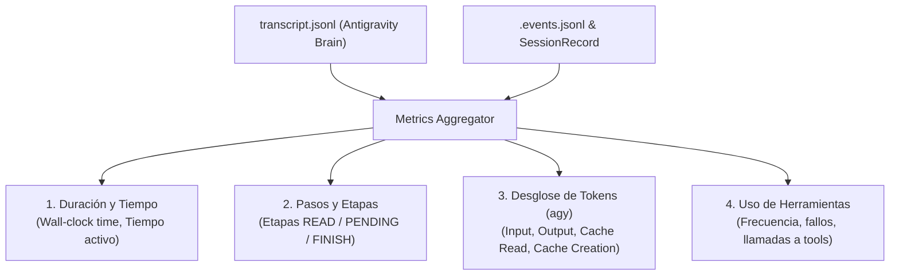

# Métricas y Telemetría

El paquete `internal/features/metrics` provee agregación y reporte del desempeño de las sesiones agénticas.

---

## Modelo de Datos y Fuentes de Telemetría

::: info Fuente de Datos por Agente
- **Google Antigravity (`agy`):** El recolector analiza directamente las trazas estructuradas locales generadas por Antigravity (`transcript.jsonl` bajo `<appDataDir>/brain/<conversationId>/`). Esto permite extraer el desglose granular de tokens (entrada, salida, lectura de caché y creación de caché) y el árbol recursivo de subagentes.
- **Otros Agentes (`claude`, `opencode`, `pi-agent`):** La telemetría consolida duración de proceso (wall-clock time), códigos de salida y los eventos estructurados reportados en `.harness/sessions/<id>.events.jsonl`.
:::



---

## Desglose Detallado de Tokens (Antigravity / Gemini)

Cuando la sesión se ejecuta con el driver `agy`, el recolector extrae de `transcript.jsonl`:

- **Input Tokens:** Tokens de entrada procesados sin coincidencia en caché.
- **Output / Completion Tokens:** Tokens generados por el modelo de IA.
- **Cache Read Tokens:** Tokens recuperados desde el caché del contexto.
- **Cache Write / Creation Tokens:** Tokens indexados para su reutilización en turnos subsiguientes.

---

## Métricas de Subagentes

En sesiones donde Antigravity invoca recursivamente subagentes (vía `invoke_subagent`):
1. El agregador identifica cada `conversationId` de los subagentes a partir del transcript padre.
2. Sumariza los totales de tokens y herramientas de forma jerárquica.
3. Ofrece una vista consolidada en `gz-ia session metrics <id> --detailed`.

---

## Uso desde la CLI: `session metrics`

Para consultar el reporte de métricas de una sesión:

```bash
# Vista formateada en terminal
gz-ia session metrics 3f9a12c8

# Vista detallada con desglose por herramienta y subagentes
gz-ia session metrics 3f9a12c8 --detailed

# Salida JSON estructurada para CI/CD o dashboards
gz-ia session metrics 3f9a12c8 --json
```

### Ejemplo de Salida JSON

```json
{
  "session_id": "3f9a12c8",
  "status": "COMPLETED",
  "duration_seconds": 182.4,
  "steps_total": 14,
  "tokens": {
    "input": 45120,
    "output": 3890,
    "cache_read": 128400,
    "cache_creation": 12400,
    "total": 189810
  },
  "tools": {
    "invocations_total": 8,
    "success_rate": 1.0,
    "most_used": "worktree_read"
  }
}
```
