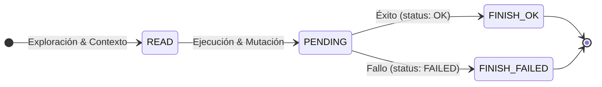

# Observabilidad y Registro de Eventos

Para registrar y auditar de forma estructurada las etapas de trabajo de los agentes y subagentes, `gz-ia` implementa un subsistema de eventos en `internal/features/logger`.

El mecanismo central es el comando `gz-ia session log`, que permite a los agentes, scripts o herramientas MCP emitir registros del ciclo de vida de cada tarea.

---

## El Ciclo de Etapas: `READ` $\rightarrow$ `PENDING` $\rightarrow$ `FINISH`

Las tareas y subtareas se registran siguiendo 3 etapas secuenciales:



1. **`READ` (Exploración & Contexto):**
   - El agente o subagente examina el código fuente, lee documentación o analiza el problema.
   - Estado caracterizado por ser de solo lectura.
2. **`PENDING` (Ejecución & Modificación):**
   - El agente inicia la edición de archivos, creación de tests o ejecución de herramientas de compilación.
   - Etapa activa de computación o mutación del workspace.
3. **`FINISH` (Finalización & Conclusión):**
   - El agente reporta la conclusión de la etapa con un estado:
     - `OK`: La tarea concluyó satisfactoriamente.
     - `FAILED`: Ocurrió un error (el campo `error` documenta la causa).

---

## Formato del Evento (`.events.jsonl`)

Cada evento se almacena como una línea JSON independiente en `.harness/sessions/<id>.events.jsonl`, permitiendo streaming y procesamiento concurrente sin bloqueo:

```json
{
  "timestamp": "2026-09-24T18:15:22.104Z",
  "session_id": "3f9a12c8",
  "action": "Analizar interfaz de base de datos",
  "stage": "READ",
  "status": "OK",
  "agent": "agy",
  "role": "code-analyst",
  "duration_ms": 340,
  "error": ""
}
```

### Soporte para Subagentes Recursivos

Cuando un agente invoca a un subagente secundario para delegar una subtarea especializada, el evento incluye el campo `parent_session_id` o metadatos de linaje:

```json
{
  "timestamp": "2026-09-24T18:16:05.890Z",
  "session_id": "sub_9c2d14e7",
  "parent_session_id": "3f9a12c8",
  "action": "Ejecutar pruebas unitarias de integración",
  "stage": "PENDING",
  "status": "OK",
  "agent": "claude",
  "role": "test-runner",
  "duration_ms": 1250,
  "error": ""
}
```

Esto permite reconstruir el árbol completo de ejecución distribuida entre múltiples agentes cooperantes.

---

## Inyección de Eventos: `session log`

Tanto los scripts de automatización como los propios agentes (a través de llamadas al CLI o herramientas MCP) pueden registrar eventos en la sesión:

```bash
# Registrar inicio de fase de lectura
gz-ia session log 3f9a12c8 \
  --action "Indexar dependencias" \
  --stage READ \
  --status OK \
  --agent agy

# Registrar finalización exitosa
gz-ia session log 3f9a12c8 \
  --action "Indexar dependencias" \
  --stage FINISH \
  --status OK \
  --agent agy \
  --duration 420
```

---

## Transmisión y Consulta de Logs: `session logs`

Permite visualizar la cronología de eventos o conectarse en modo *streaming* en vivo:

```bash
# Consultar los eventos históricos de la sesión
gz-ia session logs 3f9a12c8

# Seguir en vivo la llegada de nuevos eventos (equivalente a tail -f)
gz-ia session logs 3f9a12c8 --follow

# Emitir los eventos en formato JSON crudo para canalizar con jq
gz-ia session logs 3f9a12c8 --json | jq '.action'
```
