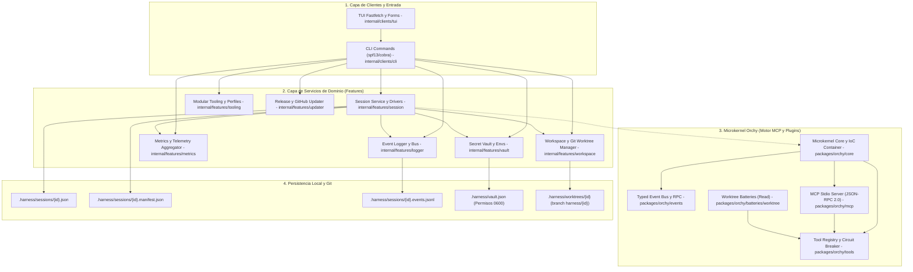
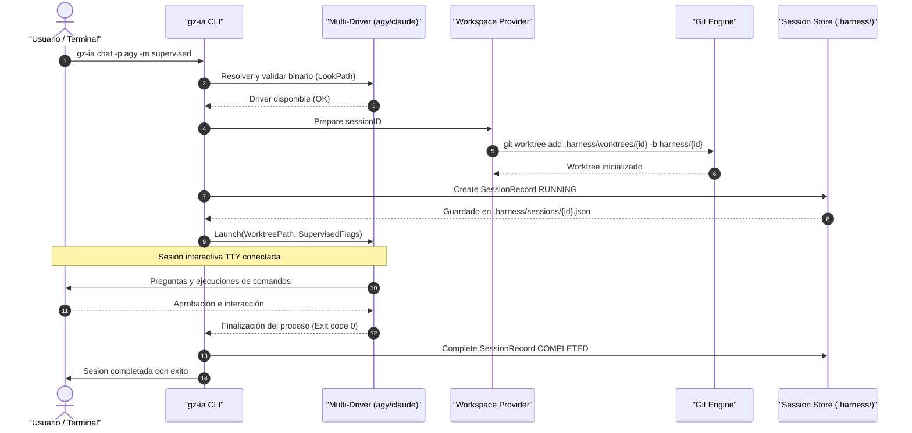

# Visión General de Arquitectura

`gz-ia` está estructurado siguiendo una arquitectura desacoplada y modular en capas concéntricas, donde la responsabilidad de cada paquete está rígidamente delimitada para garantizar extensibilidad, testeabilidad y resistencia a fallos.

---

## Diagrama de Capas del Sistema

---

## Detalle de las Tres Capas Principales

### 1. Capa de Clientes (`internal/clients/`)

Esta capa maneja la interacción directa con el usuario, procesa argumentos y formatea las respuestas:

- **`internal/clients/cli`:** Construida sobre `spf13/cobra`. Proporciona el árbol completo de comandos y subcomandos (`chat`, `session`, `vault`, `mcp`, `update`, `version`). No contiene lógica de negocio; valida parámetros e invoca a los servicios de dominio.
- **`internal/clients/tui`:** Construida con `charmbracelet/bubbletea`, `lipgloss` y `huh`. Proporciona la experiencia visual guiada con menús accesibles, banners de telemetría y diálogos interactivos de confirmación.

### 2. Capa de Servicios de Dominio (`internal/features/`)

El núcleo operativo de la CLI de `gz-ia`, completamente desacoplado de la terminal:

- **`session` (`internal/features/session`):** Orquesta el ciclo de vida de cada sesión, gestiona los drivers de los agentes (`agy`, `claude`, `opencode`, `pi-agent`), controla procesos en segundo plano y almacena atómicamente la metadata en `.harness/sessions/<id>.json`.
- **`workspace` (`internal/features/workspace`):** Administra el ciclo de vida de los **Git Worktrees** efímeros, la creación de ramas `harness/<id>`, el manifiesto de proyección atómico (`.manifest.json`) y el fallback seguro en directorios planos si Git no está inicializado.
- **`vault` (`internal/features/vault`):** Almacén seguro de secretos y variables de entorno centralizadas (`.harness/vault.json` con permisos `0600`), enmascaramiento de valores y detección automática de credenciales faltantes.
- **`tooling` (`internal/features/tooling`):** Gestión y composición de perfiles agénticos y toolkits modulares (`tooling/config.json`, directivas `AGENTS.md`, `rules/`, `skills/` y registro dinámico de herramientas en el microkernel).
- **`logger` (`internal/features/logger`):** Captura y persiste el log estructurado de etapas de razonamiento y acciones en formato JSONL (`.events.jsonl`).
- **`metrics` (`internal/features/metrics`):** Agrega y analiza métricas de ejecución: duración total, pasos completados, consumo de tokens (input, output, caché) y llamadas a herramientas por cada agente y subagente.
- **`updater` (`internal/features/updater`):** Comprueba actualizaciones y nuevas versiones publicadas en GitHub Releases, gestiona descargas y reemplaza atómicamente el ejecutable.

### 3. Microkernel Orchy (`packages/orchy/`)

Un paquete autónomo y reutilizable ubicado en `packages/orchy` que provee:

- **Inversión de Control (IoC):** `ServiceContainer` y `KernelContext` para registrar dependencias desacopladas.
- **Honest Microkernel & Circuit Breaker:** Supervisa el estado de salud de cada herramienta registrada (`HEALTHY`, `DEGRADED`, `DEAD`) mediante `ToolProxy`.
- **Servidor MCP Nativo:** Exposición de herramientas a cualquier agente compatible con el protocolo MCP (Model Context Protocol) a través de canales estándar (`io.Reader` / `io.Writer`).
- **Baterías Incluidas:** Plugins de worktrees para inspección segura (`worktree_read` expuesta a agentes por defecto) e integración controlada (`worktree_get`).

---

## Flujo de Ejecución de una Sesión de Chat

