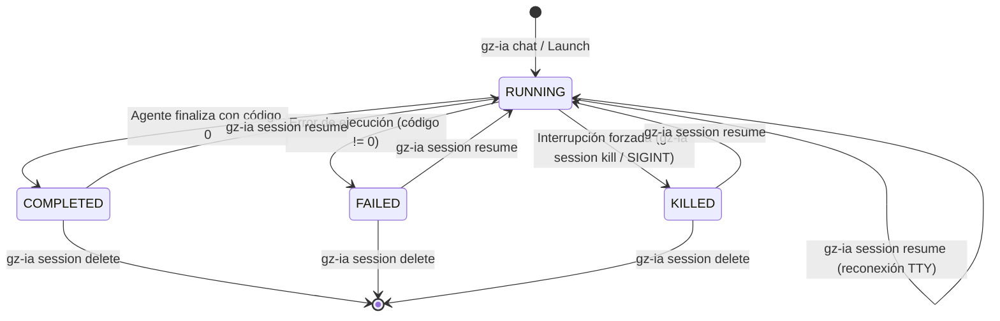

# Ciclo de Vida y Persistencia de Sesiones

Cada interacción de un agente de inteligencia artificial en `gz-ia` se modela formalmente como una **Sesión**, gestionada por `internal/features/session`.

---

## Máquina de Estados de una Sesión

El ciclo de vida de una sesión sigue una máquina de estados determinista y libre de condiciones de carrera:



### Definición de Estados

| Estado | Significado | Condiciones de Transición |
| :--- | :--- | :--- |
| `RUNNING` | El proceso del agente está en ejecución activa o el worktree está reservado. | Estado inicial tras invocar `gz-ia chat` o reanudar con `session resume`. |
| `COMPLETED` | La sesión terminó de forma regular con código de salida `0`. | El agente finalizó la tarea o el usuario cerró el chat normalmente. |
| `FAILED` | El agente finalizó con un código de error distinto de cero o abortó abruptamente. | Error interno del modelo, fallo de compilación o excepción no controlada. |
| `KILLED` | El proceso de la sesión fue terminado forzosamente por el usuario. | Invocación explícita de `gz-ia session kill <id>` o señal `SIGKILL`. |

---

## Estructura del Archivo de Registro (`SessionRecord`)

Toda la metadata de la sesión se almacena de forma persistente y atómica en formato JSON dentro de `.harness/sessions/<id>.json`:

```json
{
  "id": "3f9a12c8",
  "provider": "agy",
  "permission": "supervised",
  "status": "COMPLETED",
  "worktree_dir": "/home/user/project/.harness/worktrees/3f9a12c8",
  "is_worktree": true,
  "git_branch": "harness/3f9a12c8",
  "base_dir": "/home/user/project",
  "pid": 48120,
  "exit_code": 0,
  "prompt": "Implementar endpoints REST para autenticación",
  "created_at": "2026-09-24T18:00:00Z",
  "updated_at": "2026-09-24T18:32:10Z",
  "completed_at": "2026-09-24T18:32:10Z"
}
```

### Garantía de Escritura Atómica

Para evitar corrupciones de datos en caso de apagados repentinos o caídas del sistema, `gz-ia` escribe los registros primero en un archivo temporal (`.harness/sessions/<id>.json.tmp`) y luego realiza una operación de sustitución atómica (`os.Rename`), garantizando consistencia absoluta en el disco.

---

## Operaciones de Gestión de Sesiones

`gz-ia` ofrece un catálogo completo de comandos para gobernar las sesiones:

### Listado Rápido (`session list`)
Muestra una tabla con el identificador, agente, estado, rama y tiempo transcurrido de todas las sesiones registradas:

```bash
gz-ia session list
```

### Inspección Profunda (`session show`)
Despliega todos los campos del `SessionRecord`, incluyendo rutas completas, códigos de salida y métricas:

```bash
gz-ia session show 3f9a12c8
```

### Terminación Forzada (`session kill`)
Envía de forma segura una señal `SIGTERM` al PID de la sesión y, si el proceso no responde tras un umbral de tiempo, escala a `SIGKILL`, actualizando el estado de la sesión a `KILLED`:

```bash
gz-ia session kill 3f9a12c8
```

### Reanudación Transparente (`session resume`)
Reconecta la terminal con el agente en el espacio de trabajo original. Detecta el proveedor registrado e inyecta la bandera correspondiente (`--continue` para `agy`/`opencode`, `--resume` para `claude`/`pi-agent`):

```bash
gz-ia session resume 3f9a12c8
# Alias abreviado:
gz-ia session continue 3f9a12c8
```

### Obtención de Ruta para Scripts (`session path`)
Imprime en `stdout` la ruta absoluta del directorio de trabajo de la sesión sin texto adicional, ideal para integrarse en scripts de shell:

```bash
cd $(gz-ia session path 3f9a12c8)
```
