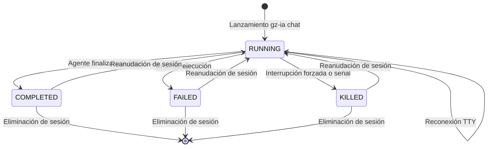

# Ciclo de Vida y Persistencia de Sesiones

Cada interacción de un agente de inteligencia artificial en `gz-ia` se modela formalmente como una **Sesión**, gestionada por `internal/features/session`.

---

## Máquina de Estados de una Sesión

El ciclo de vida de una sesión sigue una máquina de estados determinista y libre de condiciones de carrera:



### Definición de Estados

| Estado | Significado | Condiciones de Transición |
| :--- | :--- | :--- |
| `RUNNING` | El proceso del agente está en ejecución activa o el worktree está reservado. | Estado inicial tras invocar `gz-ia chat` o reanudar con `session resume`. |
| `COMPLETED` | La sesión terminó de forma regular con código de salida `0`. | El agente finalizó la tarea o el usuario cerró el chat normalmente. |
| `FAILED` | El agente finalizó con un código de error distinto de cero o abortó abruptamente. | Error interno del modelo, fallo de compilación o excepción no controlada. |
| `KILLED` | El proceso de la sesión fue terminado forzosamente por el usuario. | Invocación explícita de `gz-ia session kill <id>` o señal `SIGKILL`. |

---

## Estructura del Archivo de Registro (`SessionRecord`)

Toda la metadata de la sesión se almacena de forma persistente y atómica en formato JSON dentro de `.harness/sessions/<id>.json`:

```json
{
  "id": "3f9a12c8",
  "conversation_id": "conv-8f7a9b0c-1234-5678-9abc-def012345678",
  "provider": "agy",
  "permission": "supervised",
  "status": "COMPLETED",
  "worktree_dir": "/home/user/project/.harness/worktrees/3f9a12c8",
  "is_worktree": true,
  "git_branch": "harness/3f9a12c8",
  "base_dir": "/home/user/project",
  "pid": 48120,
  "exit_code": 0,
  "prompt": "Implementar endpoints REST para autenticación",
  "created_at": "2026-09-24T18:00:00Z",
  "updated_at": "2026-09-24T18:32:10Z",
  "completed_at": "2026-09-24T18:32:10Z"
}
```

### Escritura Atómica

Para evitar corrupción de datos en caso de caídas del proceso o interrupciones del sistema, `gz-ia` escribe los registros primero en un archivo temporal (`.harness/sessions/<id>.json.tmp`) y luego realiza una sustitución atómica (`os.Rename`), manteniendo la consistencia en disco.

---

## Observabilidad, Cierre Garantizado y Manifiesto Dinámico

`gz-ia` implementa mecanismos automáticos y resilientes para garantizar el cierre ordenado de sesiones, la captura de telemetría y la auditoría de cambios en el espacio de trabajo.

### Persistencia de `conversation_id` y Cierre Garantizado (`defer`)

Cada sesión almacena y recupera de forma persistente el `conversation_id` asignado por el motor agéntico nativo (por ejemplo, Google Antigravity). Para asegurar que el ciclo de vida finalice de forma consistente ante cualquier escenario de término (éxito, error de proceso, pánico en tiempo de ejecución o interrupción):

- **Bloque de Cierre `defer`:** Se ejecuta incondicionalmente al salir de `Session.Start`.
- **Registro Seguro de Métricas:** Almacena de forma garantizada los campos `FinishedAt`, `DurationMs`, `ExitCode` y el estado final (`COMPLETED` o `FAILED`) en el `SessionRecord`.
- **Evento de Cierre (`StageFinish`):** Emite el evento de observabilidad `logger.StageFinish` en `.harness/sessions/<id>.events.jsonl` registrando la acción (`Sesión finalizada exitosamente` o `Sesión finalizada con fallas`), el código de salida, la duración total en segundos y el resumen diff de archivos modificados (`files_changed`).

### Sincronización Automática de Telemetría (`SyncTelemetry`)

Durante la fase de cierre garantizado, `gz-ia` ejecuta `SyncTelemetry` para consolidar las trazas de ejecución del agente en el registro de observabilidad del arnés:

- **Localización de Trazas:** Inspecciona la estructura del motor agéntico nativo (`~/.gemini/antigravity-cli/brain/<conversation_id>/.system_generated/logs/transcript.jsonl`) resolviendo el `conversation_id` asociado.
- **Sincronización de Tool Calls y Subagentes:** Parsea los pasos (`PlannerResponseStep`) e identifica llamadas a herramientas (`tool_calls`) e invocación de subagentes (`invoke_subagent`).
- **Mapeo a Eventos (`events.jsonl`):** Mapea cada invocación a un evento estructurado en `.harness/sessions/<id>.events.jsonl` con claves únicas de evento (`event_key`) para garantizar idempotencia. Clasifica las etapas entre lecturas (`StageRead` para `view_file`, `search_web`, `read_url_content`, `read_browser_page`, etc.) y ejecuciones (`StagePending`).

### Auditoría y Actualización Dinámica del Manifiesto Delta (`UpdateManifestDelta`)

Para mantener el manifiesto del espacio de trabajo (`.harness/manifest.json`) sincronizado con las mutaciones reales realizadas durante la sesión:

- **Auditoría Porcelain:** Invoca `workspace.UpdateManifestDelta(manifestPath, worktreeDir)`, ejecutando `git status --porcelain` sobre el directorio del worktree.
- **Detección de Archivos Creados y Modificados:** Clasifica los archivos detectados (`?`, `A`, etc.), agregando los nuevos archivos a `CreatedFiles` sin duplicados.
- **Recálculo de Hashes Proyectados:** Calcula y actualiza los checksums SHA-256 (`ProjectedHash`) para todos los archivos alterados o creados en el manifiesto JSON.

---

## Operaciones de Gestión de Sesiones

`gz-ia` provee comandos para administrar el ciclo de vida de las sesiones:

### Listado (`session list`)
Muestra una tabla con el identificador, agente, estado, rama y tiempo transcurrido de todas las sesiones registradas:

```bash
gz-ia session list
```

### Inspección (`session show`)
Despliega todos los campos del `SessionRecord`, incluyendo rutas completas, códigos de salida y métricas:

```bash
gz-ia session show 3f9a12c8
```

### Terminación de Procesos (`session kill`)
Envía una señal `SIGTERM` al grupo de procesos de la sesión y, si no responde tras el tiempo de espera, escala a `SIGKILL` (en Windows utiliza `taskkill /F /T`), actualizando el estado de la sesión a `KILLED`:

```bash
gz-ia session kill 3f9a12c8
```

### Reanudación de Sesiones (`session resume`)
Reconecta la terminal con el agente en el espacio de trabajo original. Detecta el proveedor registrado e inyecta la bandera correspondiente (`--continue` para `agy`/`opencode`, `--resume` para `claude`/`pi-agent`):

```bash
gz-ia session resume 3f9a12c8
# Alias abreviado:
gz-ia session continue 3f9a12c8
```

#### Re-proyección y Actualización de Toolkits en Resume (`--reload-toolkits` / `-r`)
Por defecto, al reanudar una sesión (`Resume`), si el espacio de trabajo o worktree de la sesión ya cuenta con un manifiesto (`.harness/manifest.json`), se omite la fase de proyección para evitar sobreescrituras innecesarias. 

Al especificar la bandera `--reload-toolkits` (o `-r`):
```bash
gz-ia session resume 3f9a12c8 --reload-toolkits
```
El orquestador fuerza la re-evaluación (`Tooling.ReloadToolkits`), resolviendo los perfiles asignados (`record.Profiles`), componiendo nuevamente los toolkits y re-proyectando atómicamente:
- **Directivas y Reglas:** Actualiza `AGENTS.md` y `.agents/rules/*.md`.
- **Habilidades (*Skills*):** Sincroniza `.agents/skills/`.
- **Manifiestos MCP:** Re-evalúa la configuración de servidores MCP del preset/toolkit, preservando la reserva interna del servidor `gz-ia`.

---

### Recarga en Caliente de Toolkits (`session reload-toolkits`)
Permite actualizar la configuración, reglas, habilidades y servidores MCP de los toolkits asignados a una sesión **sin interrumpir el proceso ni reiniciar la sesión**:

```bash
gz-ia session reload-toolkits 3f9a12c8
```

#### Mecanismo Operativo:
1. **Recuperación de Estado:** Obtiene el `SessionRecord` desde `.harness/sessions/<id>.json` e identifica el directorio de trabajo objetivo (`worktree_dir` o `working_dir`).
2. **Re-composición Atómica:** Invoca a `tooling.Service.ReloadToolkits`, resolviendo los perfiles activos y componiendo la nueva estructura de directivas y servidores MCP.
3. **Proyección en el Worktree:** Aplica las modificaciones en el árbol de trabajo de la sesión y actualiza el manifiesto persistente.
4. **Registro Teleférico de Observabilidad:** Emite un evento `logger.Event` estructurado con la acción `Toolkits recargados exitosamente (<perfiles>)` en `.harness/sessions/<id>.events.jsonl` para rastrear la recarga en caliente.

---

### Obtención de Ruta para Scripts (`session path`)
Imprime en `stdout` la ruta absoluta del directorio de trabajo de la sesión sin texto adicional, ideal para integrarse en scripts de shell:

```bash
cd $(gz-ia session path 3f9a12c8)
```
