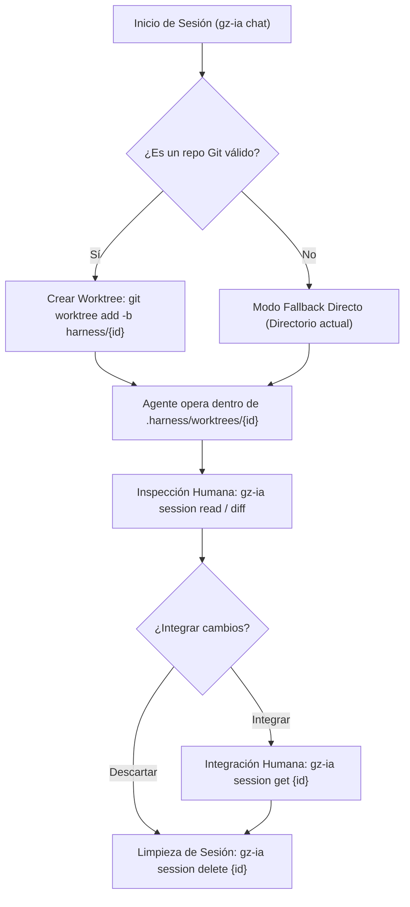

# Desacoplamiento con Git Worktrees

Para evitar que los agentes de IA interfieran con el trabajo activo del desarrollador sin sobrecargar el almacenamiento con clones completos de disco, `gz-ia` utiliza **Git Worktrees**.

---

## Qué Aísla y Qué No Aísla un Git Worktree

Alcance y límites del aislamiento:

### Qué sí aísla: El árbol de archivos de trabajo (Working Tree)
- **Archivos independientes en disco:** Cada sesión opera en `.harness/worktrees/<id>` sobre una rama dedicada `harness/<id>`.
- **Protección del editor:** El agente no altera los archivos abiertos en el IDE ni la compilación en caliente (*hot-reload*).
- **Control de estado en la rama base:** La rama base permanece limpia; su `git status` no se altera mientras el agente opera en paralelo.

### Guardrails de Git en el Worktree (Protección de Repositorio)
Para prevenir errores y modificaciones accidentales en Git, `gz-ia` configura guardrails activos por worktree:
- **Bloqueo de `git push` (`pre-push` hook):** Impide que comandos automáticos envíen cambios al remoto desde el worktree de la sesión.
- **Protección de ramas (`reference-transaction` hook):** El agente solo tiene permitido operar dentro de su propia rama (`refs/heads/harness/<sessionID>` y `HEAD`). No puede modificar `main`, `master`, ni la rama de otra sesión simultánea (`refs/heads/harness/<otra-sesión>`).
- **Reenvío de hooks de proyecto (Husky, lint-staged, commitlint):** Si el repositorio base cuenta con hooks de `commit-msg` o `pre-commit`, los hooks del worktree los invocan directamente para preservar las convenciones de commit del proyecto.
- **Manifiesto de proyección agéntica y eliminación de `core.excludesFile`:** En versiones anteriores se recurría a `core.excludesFile`, lo cual resultaba frágil ante diferentes versiones de Git y podía enmascarar archivos del proyecto. `gz-ia` sustituyó este mecanismo por un **Manifiesto de Proyección** explícito (`.harness/sessions/<id>.manifest.json`). Este archivo registra con exactitud qué archivos fueron proyectados de forma efímera y cuáles pertenecían originalmente al repositorio base.
- **Configuración aislada (`extensions.worktreeConfig`):** La directiva `core.hooksPath` se establece exclusivamente a nivel de worktree (`config.worktree`) sin afectar la configuración global del repositorio.

### Manifiesto de Proyección y Fusión No Destructiva
Al inicializar una sesión o proyectar perfiles (`-P`), `gz-ia` persiste en `.harness/sessions/<id>.manifest.json` un registro atómico con la siguiente estructura:
- **`CreatedFiles` (`[]string`):** Rutas relativas creadas en el worktree que no existían previamente en el repositorio (ej. directivas sintéticas de sesión `*-AGENTS.md`, symlinks efímeros en `.agents/skills/`).
- **`OriginalFiles` (`map[string]string`):** Mapa de ruta relativa a su contenido textual previo a la proyección. Aplica a archivos legítimos preexistentes en el repositorio que requirieron fusión en caliente (como un `AGENTS.md` del equipo o un `.mcp.json` compartido).
- **`ProjectedHash` (`map[string]string`):** Suma SHA-256 de lo que proyectó `gz-ia` para cada ruta al montar la sesión.

#### Comportamiento No Destructivo en `session get` y `session diff`
1. **Preservación de archivos legítimos del repositorio:** Archivos como `.agents/config.json` o `.mcp.json` que formaban parte del repositorio antes de la sesión **no se eliminan**. Si el agente no alteró su contenido (su hash en el worktree coincide con `ProjectedHash`), son restaurados a su versión previa (`OriginalFiles`) antes del merge o cálculo de diff.
2. **Preservación de ediciones intencionales del agente:** Si durante la sesión el agente edita un archivo proyectado (por ejemplo, actualiza o añade una convención de equipo a `AGENTS.md`), el hash actual diferirá de `ProjectedHash`. El harness detecta la mutación y **preserva los cambios del agente**, incorporándolos a la rama base en `session get`.
3. **Purga de artefactos efímeros:** Si un archivo perteneciente a `CreatedFiles` mantiene su hash original proyectado (`ProjectedHash`), el arnés lo remueve antes de integrar los cambios, evitando residuos en el historial de Git.

### Alcance y Límites de los Guardrails
> [!IMPORTANT] Límites de los Guardrails
> Los guardrails de Git previenen operaciones accidentales habituales (como ejecutar `git push` o alterar ramas activas).
> **No constituyen un sandbox de seguridad hermético:** Un agente con acceso a shell y permisos autónomos podría eludir los hooks ejecutando `git push --no-verify`, sobrescribiendo la configuración con `git -c core.hooksPath=/dev/null`, o accediendo al repositorio base con `cd ../../../`.
> Para contención estricta frente a código no confiable, se debe ejecutar `gz-ia` dentro de un contenedor **Docker** o **DevContainer**.

---

## ¿Qué es un Git Worktree?

Un Git Worktree es una capacidad nativa de Git que permite tener múltiples árboles de trabajo vinculados a un único repositorio local (`.git`).

A diferencia de un `git clone`:
- **Sin duplicar historial:** Todos los worktrees comparten el mismo almacén de objetos (`.git/objects`).
- **Creación en milisegundos:** Se inicializan instantáneamente sin descargar ni copiar el historial.
- **Ramas dedicadas:** Cada worktree opera con su propio puntero `HEAD`.

---

## Ciclo de Vida del Worktree en `gz-ia`



---

## Estructura en Disco

Cuando se lanza una sesión con el ID `a8f1b2c3`, la estructura dentro del repositorio es:

```text
mi-proyecto/
├── .git/
├── .harness/
│   ├── vault.json                     # Secretos seguros del proyecto (0600)
│   ├── sessions/
│   │   ├── a8f1b2c3.json              # Registro de la sesión
│   │   ├── a8f1b2c3.manifest.json     # Manifiesto de proyección agéntica
│   │   └── a8f1b2c3.events.jsonl       # Observabilidad y eventos
│   └── worktrees/
│       └── a8f1b2c3/                  # Working tree de la sesión
│           ├── cmd/
│           ├── internal/
│           └── ...archivos del proyecto...
├── cmd/                               # Tu espacio de trabajo activo intacto
└── internal/
```

La rama de Git creada para la sesión es `harness/a8f1b2c3`.

---

## Flujos de Trabajo: `read` y `get`

Para interactuar con el código producido por el agente sin cambiar de rama ni ensuciar tu directorio de trabajo, `gz-ia` define dos acciones claras:

### 1. Inspeccionar Cambios: `session read`

Inspecciona las modificaciones dentro del worktree de la sesión:

```bash
# Ver el diff completo producido por el agente
gz-ia session read a8f1b2c3

# Ver resumen estadístico de archivos modificados
gz-ia session read a8f1b2c3 --stat
```

::: tip Diferencia entre `session diff` y `session read`
- `gz-ia session diff <id>` emite las diferencias git directas en formato unificado de terminal.
- `gz-ia session read <id>` es la interfaz homogénea que consumen tanto humanos como herramientas MCP ([`worktree_read`](/orchy/batteries#worktree-read)), retornando un formato estandarizado.
:::

### 2. Traer e Integrar Cambios: `session get`

La integración es una **acción exclusivamente humana**. `gz-ia` no permite que el agente aplique cambios de forma autónoma hacia tu rama base.

```bash
# Traer los cambios del worktree al workspace activo como modificaciones unstaged
gz-ia session get a8f1b2c3
```

#### Semántica Técnica de `session get`:
1. **Reconciliación y limpieza según el Manifiesto de Sesión:** Inspecciona `.harness/sessions/<id>.manifest.json`. Los archivos proyectados no modificados se retiran y los archivos legítimos preexistentes (`OriginalFiles`) se restauran a su estado original si no fueron tocados, preservando a su vez las ediciones intencionales realizadas por el agente.
2. **Transferencia de modificaciones en modo Unstaged:** Copia las modificaciones de archivos y los archivos nuevos creados en la sesión directamente al directorio de trabajo activo como cambios no preparados (*unstaged*).
3. **Soberanía Estricta de Git (Cero Merge Commits):** No realiza `git merge` ni crea commits automáticos en el repositorio principal, evitando mezclar ramas intermediarias o generar conflictos de merge en Git.
4. **Inspección de Contexto Previor:** Se recomienda utilizar `gz-ia session context <id>` antes de integrar para revisar el historial completo de eventos de la sesión, los agentes participantes y la lista exacta de archivos mutados.

---

## Consideraciones Prácticas: Watchers, Linters, Dependencias y Plataformas

### 1. Exclusión de `.harness/` en herramientas de análisis y bundlers
Dado que cada worktree contiene una copia de los archivos del proyecto, es fundamental configurar las exclusiones en las herramientas del proyecto para evitar indexaciones innecesarias o fallos de compilación:

- **Exclusión limpia vía `.git/info/exclude`:** `gz-ia` añade automáticamente `.harness/` a `.git/info/exclude` (resuelto nativamente con `git rev-parse --git-path info/exclude`). De esta manera, tu `git status` permanece completamente limpio sin modificar el archivo `.gitignore` compartido del proyecto ni generar commits accidentales.
- **Jest (`jest.config.js`):** Cada worktree copia el `package.json`, provocando el error `Haste module naming collision`. Ignora `.harness/`:
  ```javascript
  module.exports = {
    modulePathIgnorePatterns: ['<rootDir>/.harness/'],
  };
  ```
- **ESLint Flat Config (`eslint.config.js`):**
  ```javascript
  export default [
    {
      ignores: ['**/.harness/**'],
    },
  ];
  ```
- **TypeScript (`tsconfig.json`):** Si compilas todo el proyecto (`tsc -b`), añade la exclusión para evitar que el compilador indexe tipos duplicados dentro de `.harness`:
  ```json
  {
    "exclude": ["node_modules", ".harness"]
  }
  ```
- **Dev Servers (Vite, Webpack, Turbopack):** Para evitar que el servidor de desarrollo recargue continuamente la aplicación cuando el agente edita archivos en el worktree, excluye `.harness/**` en la configuración del watcher. En **Vite** (`vite.config.ts`):
  ```ts
  export default defineConfig({
    server: {
      watch: {
        ignored: ['**/.harness/**']
      }
    }
  })
  ```
- **Tailwind CSS:** Evita globs genéricos sobre la raíz (`./**/*.{ts,tsx}`) que escanean copias dentro de `.harness/worktrees/`; delimita el content a las carpetas de código fuente (ej. `./src/**/*.{ts,tsx}`, `!./.harness/**`).
- **File Watchers en IDEs:** En VS Code o JetBrains, excluye `.harness/` en `files.watcherExclude` para reducir consumo innecesario de memoria y CPU.

::: warning El compromiso de diseño de los worktrees locales
La decisión de almacenar los worktrees dentro del repositorio (`.harness/worktrees/`) aporta aislamiento autónomo y portabilidad absoluta sin requerir permisos fuera del árbol ni directorios temporales arbitrarios. Su contrapartida explícita es la fricción en configuraciones compartidas de frontend (`jest.config`, `tsconfig`, `vite.config`, etc.), que deben ignorar expresamente `.harness/` para evitar colisiones.
:::

### 2. Gestión de Dependencias (Node / Frontend)
En proyectos Node/Frontend, un worktree nuevo no hereda `node_modules` automáticamente al ser un árbol de archivos separado:
- **npm / yarn:** Ejecutar `npm ci` o `npm install` en cada sesión puede ser pesado y consumir tiempo.
- **Recomendación con pnpm / bun:** Se recomienda usar gestores basados en enlaces globales como **pnpm** o **bun**, que comparten paquetes a través de enlaces duros en disco sin duplicar espacio.
- **Symlinks manuales (3 niveles):** Para tareas rápidas, crea un symlink subiendo tres niveles desde el worktree hasta la raíz del proyecto:
  ```bash
  ln -s $(gz-ia session path <id>)/../../../node_modules $(gz-ia session path <id>)/node_modules
  ```
  *(Nota: si tu `.gitignore` define `node_modules/` con barra final, cámbialo a `node_modules` sin barra para que Git ignore también el symlink y no intente commitearlo en `session get`).*

### 3. Soporte de Plataformas (Linux & Windows)
`gz-ia` compila de forma nativa para:
- **Linux:** Soporte completo en distribuciones modernas (Ubuntu, Debian, Fedora, Arch, etc.).
- **Windows:** Soporte nativo para sistemas Windows de 64 bits (amd64).

### 4. Comportamiento en Submódulos de Git
`ResolveProjectRoot` utiliza `git rev-parse --show-toplevel`. Si ejecutas `gz-ia` desde el interior de un submódulo, la raíz se resuelve intencionalmente a la del **submódulo activo**, ya que cada submódulo constituye un repositorio Git independiente con sus propias ramas, commits y remotos. Si deseas que la sesión opere sobre el repositorio principal contenedor, debes ejecutar el comando desde la raíz del superproyecto.

---

## Destrucción y Limpieza: `session delete`

Cuando la sesión finaliza o decides descartar el experimento:

```bash
gz-ia session delete a8f1b2c3
```

Este comando realiza una limpieza segura:
1. Comprueba si el proceso del agente sigue activo (y lo detiene si es necesario).
2. Ejecuta `git worktree remove --force .harness/worktrees/a8f1b2c3`.
3. Elimina la rama efímera `harness/a8f1b2c3`.
4. Elimina la metadata de `.harness/sessions/a8f1b2c3.json`.
5. Si `.harness/worktrees` queda vacío, remueve el directorio.

---

## Reconciliación de Basura y Sesiones Huérfanas: `session prune`

Si en algún momento eliminas carpetas manualmente (por ejemplo con `rm -rf .harness`), interrumpes un proceso abruptamente o quedan ramas `harness/*` residuales, Git puede quedar con metadatos desfasados en `.git/worktrees/` o ramas colgadas.

Para conciliar las tres fuentes de estado (archivos `.json` de sesión, metadatos de worktrees en Git y ramas locales `harness/*`), utiliza:

```bash
gz-ia session prune
```

Este comando:
1. Revisa todos los registros de sesión activos en `.harness/sessions/`.
2. Poda y elimina cualquier carpeta de worktree huérfana en `.harness/worktrees/`.
3. Ejecuta `git worktree prune` para purgar metadatos obsoletos en `.git/worktrees/`.
4. Elimina de forma segura todas las ramas `harness/*` que ya no tengan una sesión activa asociada.

---

## Modo Fallback Directo

Si ejecutas `gz-ia` dentro de un directorio que no es un repositorio Git (o si el comando `git` no está disponible en el entorno):
- `gz-ia` detecta automáticamente la condición.
- Registra `IsWorktree = false` en el `SessionRecord`.
- Ejecuta la sesión directamente en el directorio actual, notificando al usuario.
- El arnés no bloquea el flujo si Git no está inicializado.

