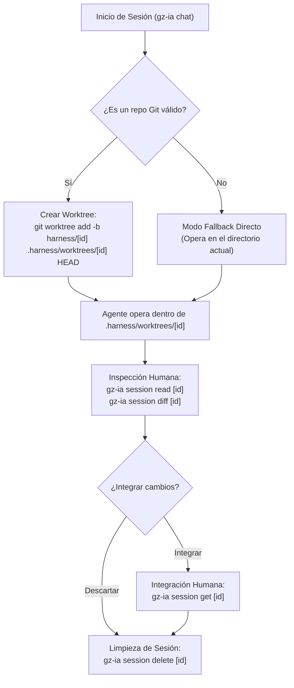

# Desacoplamiento con Git Worktrees

Para evitar que los agentes de IA interfieran con el trabajo activo del desarrollador sin sobrecargar el almacenamiento con clones completos de disco, `gz-ia` utiliza **Git Worktrees**.

---

## Qué Aísla y Qué No Aísla un Git Worktree

Es fundamental delimitar con claridad técnica el alcance y los límites del aislamiento:

### Qué sí aísla: El árbol de archivos de trabajo (Working Tree)
- **Archivos independientes en disco:** Cada sesión opera en `.harness/worktrees/<id>` sobre una rama dedicada `harness/<id>`.
- **Protección del editor:** El agente no toca los archivos abiertos en tu IDE ni tu compilación en caliente (*hot-reload*).
- **Control de estado en tu rama:** Tu rama base permanece limpia; su `git status` no se ve afectado mientras el agente trabaja en paralelo.

### Guardrails Automáticos de Git en el Worktree (Protección de Repositorio)
Para evitar que un agente autónomo con acceso a shell ejecute comandos destructivos en Git, `gz-ia` configura guardrails activos por worktree:
- **Bloqueo estricto de `git push` (`pre-push` hook):** Ningún comando de push puede enviarse a un remoto desde el worktree de la sesión. Toda publicación remota debe ser ejecutada por el operador humano en el repositorio base.
- **Protección de ramas y referencias (`reference-transaction` hook):** El agente solo tiene permitido crear o modificar referencias dentro de su propio namespace (`refs/heads/harness/*` y `HEAD`). Cualquier intento de modificar o pisar ramas principales como `main`, `master` o ramas de staging es interceptado y abortado en tiempo real.
- **Configuración aislada (`extensions.worktreeConfig`):** La directiva `core.hooksPath` se establece exclusivamente en `.git/worktrees/<id>/config.worktree`. Tu repositorio principal no tiene ningún hook restrictivo y puedes continuar haciendo commits, ramas y pushes libremente.
- **Exclusión local limpia (`.git/info/exclude`):** `.harness` se ignora automáticamente a nivel de repositorio sin ensuciar ni modificar el archivo `.gitignore` compartido del proyecto.

### Qué NO es: No es un sandbox de sistema ni de kernel
- **Sin aislamiento de procesos ni sistema operativo:** Un agente que disponga de herramientas de ejecución en terminal (shell) corre con los permisos de tu usuario local en el host.
- **Aislamiento a nivel de sistema:** Si tu caso de uso requiere contención de red, aislamiento de archivos personales (`~`) o restricciones de kernel, la ejecución debe encapsularse en contenedores (**Docker / DevContainers**) o namespaces de Linux (`bwrap`).

---

## ¿Qué es un Git Worktree?

Un Git Worktree es una capacidad nativa de Git que permite tener múltiples árboles de trabajo vinculados a un único repositorio local (`.git`).

A diferencia de un `git clone`:
- **Sin duplicar historial:** Todos los worktrees comparten el mismo almacén de objetos (`.git/objects`).
- **Creación en milisegundos:** Se inicializan instantáneamente sin descargar ni copiar el historial.
- **Ramas dedicadas:** Cada worktree opera con su propio puntero `HEAD`.

---

## Ciclo de Vida del Worktree en `gz-ia`



---

## Estructura en Disco

Cuando se lanza una sesión con el ID `a8f1b2c3`, la estructura dentro del repositorio es:

```text
mi-proyecto/
├── .git/
├── .harness/
│   ├── sessions/
│   │   ├── a8f1b2c3.json              # Registro de la sesión
│   │   └── a8f1b2c3.events.jsonl       # Observabilidad y eventos
│   └── worktrees/
│       └── a8f1b2c3/                  # Working tree de la sesión
│           ├── cmd/
│           ├── internal/
│           └── ...archivos del proyecto...
├── cmd/                               # Tu espacio de trabajo activo intacto
└── internal/
```

La rama de Git creada para la sesión es `harness/a8f1b2c3`.

---

## Flujos de Trabajo: `read` y `get`

Para interactuar con el código producido por el agente sin cambiar de rama ni ensuciar tu directorio de trabajo, `gz-ia` define dos acciones claras:

### 1. Inspeccionar Cambios: `session read`

Inspecciona las modificaciones dentro del worktree de la sesión:

```bash
# Ver el diff completo producido por el agente
gz-ia session read a8f1b2c3

# Ver resumen estadístico de archivos modificados
gz-ia session read a8f1b2c3 --stat
```

::: tip Diferencia entre `session diff` y `session read`
- `gz-ia session diff <id>` emite las diferencias git directas en formato unificado de terminal.
- `gz-ia session read <id>` es la interfaz homogénea que consumen tanto humanos como herramientas MCP ([`worktree_read`](/orchy/batteries#worktree-read)), retornando un formato estandarizado.
:::

### 2. Traer e Integrar Cambios: `session get`

La integración es una **acción exclusivamente humana**. `gz-ia` no permite que el agente ejecute la integración hacia tu rama base.

```bash
# Integrar los cambios directamente
gz-ia session get a8f1b2c3

# Integrar condensando commits en uno solo (squash)
gz-ia session get a8f1b2c3 --squash

# Integrar dejando los cambios en staging sin comitear automáticamente
gz-ia session get a8f1b2c3 --no-commit
```

#### Semántica Técnica de `session get`:
1. **Validación de precondición en repositorio base:** Antes de iniciar la integración, `gz-ia` verifica que tu repositorio base no tenga modificaciones sin comitear. Si está sucio, frena la operación y te solicita realizar `commit` o `stash` para prevenir cualquier sobreescritura accidental.
2. **Commit de seguridad previo en worktree:** Si en el worktree de la sesión existen modificaciones sin comitear o archivos untracked generados por el agente, `gz-ia` genera un commit de seguridad automático en la rama `harness/<id>` para no perder trabajo.
3. **Merge en la rama base activa:** Ejecuta un `git merge` (o `git merge --squash` si se pasa `--squash`, y sin commit si se pasa `--no-commit`) de la rama `harness/<id>` en la rama activa del repositorio.
4. **Manejo de conflictos:** Si la rama base avanzó y existen conflictos, Git detiene la operación sin sobreescribir tus archivos; informa los archivos en conflicto y mantiene el worktree de la sesión intacto para resolución manual (`gz-ia session path <id>`) o para abortar (`git merge --abort` o `git reset --merge`).

---

## Consideraciones Prácticas: Watchers, Linters, Dependencias y WSL2

### 1. Exclusión de `.harness/` en herramientas de análisis
Dado que cada worktree contiene una copia de los archivos del proyecto, es recomendable tener en cuenta la interacción con herramientas de análisis estático y watchers:

- **Exclusión limpia vía `.git/info/exclude`:** `gz-ia` añade automáticamente `.harness/` a `.git/info/exclude` (resuelto nativamente con `git rev-parse --git-path info/exclude`). De esta manera, tu `git status` permanece completamente limpio sin modificar el archivo `.gitignore` compartido del proyecto ni generar commits accidentales.
- **TypeScript (`tsconfig.json`):** Si compilas todo el proyecto (`tsc -b`), añade la exclusión para evitar que el compilador indexe tipos duplicados dentro de `.harness`:
  ```json
  {
    "exclude": ["node_modules", ".harness"]
  }
  ```
- **ESLint / Biome / Jest / Vitest:** Asegúrate de incluir `.harness/**` en los patrones de archivos ignorados (`ignorePatterns`).
- **File Watchers en IDEs:** En VS Code o JetBrains, excluye `.harness/` en `files.watcherExclude` para reducir consumo innecesario de memoria y CPU.

### 2. Gestión de Dependencias (Node / Frontend)
En proyectos Node/Frontend, un worktree nuevo no hereda `node_modules` automáticamente al ser un árbol de archivos separado:
- **npm / yarn:** Ejecutar `npm ci` o `npm install` en cada sesión puede ser pesado y consumir tiempo.
- **Recomendación con pnpm:** Se recomienda usar gestores basados en enlaces globales como **pnpm**, que comparten paquetes a través de hard links globales sin duplicar gigabytes en disco.
- **Symlinks manuales:** Para tareas rápidas, se puede crear un symlink al `node_modules` raíz dentro del worktree de la sesión si la estructura de dependencias es compatible.

### 3. Soporte de Plataformas (Linux & Windows WSL2)
`gz-ia` está diseñado para entornos POSIX estándar:
- **Linux nativo:** Soporte completo en distribuciones modernas (Ubuntu, Debian, Fedora, Arch).
- **Windows bajo WSL2:** En sistemas Windows corporativos, se recomienda ejecutar `gz-ia` dentro de **WSL2** (Windows Subsystem for Linux 2). Esto garantiza el rendimiento nativo del sistema de archivos de Git y compatibilidad con señales POSIX.

### 4. Comportamiento en Submódulos de Git
`ResolveProjectRoot` utiliza `git rev-parse --show-toplevel`. Si ejecutas `gz-ia` desde el interior de un submódulo, la raíz se resuelve intencionalmente a la del **submódulo activo**, ya que cada submódulo constituye un repositorio Git independiente con sus propias ramas, commits y remotos. Si deseas que la sesión opere sobre el repositorio principal contenedor, debes ejecutar el comando desde la raíz del superproyecto.

---

## Destrucción y Limpieza: `session delete`

Cuando la sesión finaliza o decides descartar el experimento:

```bash
gz-ia session delete a8f1b2c3
```

Este comando realiza una limpieza segura:
1. Comprueba si el proceso del agente sigue activo (y lo detiene si es necesario).
2. Ejecuta `git worktree remove --force .harness/worktrees/a8f1b2c3`.
3. Elimina la rama efímera `harness/a8f1b2c3`.
4. Elimina la metadata de `.harness/sessions/a8f1b2c3.json`.
5. Si `.harness/worktrees` queda vacío, remueve el directorio.

---

## Reconciliación de Basura y Sesiones Huérfanas: `session prune`

Si en algún momento eliminas carpetas manualmente (por ejemplo con `rm -rf .harness`), interrumpes un proceso abruptamente o quedan ramas `harness/*` residuales, Git puede quedar con metadatos desfasados en `.git/worktrees/` o ramas colgadas.

Para conciliar las tres fuentes de estado (archivos `.json` de sesión, metadatos de worktrees en Git y ramas locales `harness/*`), utiliza:

```bash
gz-ia session prune
```

Este comando:
1. Revisa todos los registros de sesión activos en `.harness/sessions/`.
2. Poda y elimina cualquier carpeta de worktree huérfana en `.harness/worktrees/`.
3. Ejecuta `git worktree prune` para purgar metadatos obsoletos en `.git/worktrees/`.
4. Elimina de forma segura todas las ramas `harness/*` que ya no tengan una sesión activa asociada.

---

## Modo Fallback Directo

Si ejecutas `gz-ia` dentro de un directorio que no es un repositorio Git (o si el comando `git` no está disponible en el entorno):
- `gz-ia` detecta automáticamente la condición.
- Registra `IsWorktree = false` en el `SessionRecord`.
- Ejecuta la sesión directamente en el directorio actual, notificando al usuario.
- El arnés no bloquea el flujo si Git no está inicializado.

