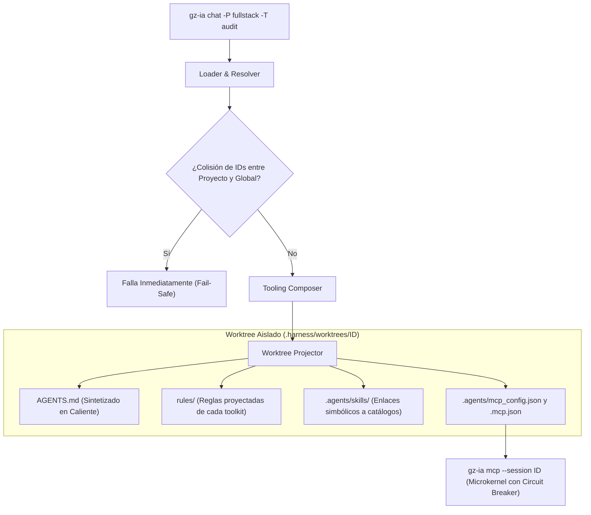

# Toolkits y Perfiles Emergentes

En Gountz IA (`gz-ia`), la configuración y capacidades del agente ya no dependen de entidades rígidas ni de archivos monolíticos. El sistema adopta un modelo donde el **Toolkit** es la **unidad atómica de capacidad**, y el **Perfil** es una **composición emergente** en tiempo de ejecución.

Este enfoque resuelve la proliferación desordenada de carpetas `.agents/`, skills duplicadas y servidores MCP dispersos entre múltiples repositorios, garantizando un repositorio principal limpio y determinismo absoluto en cada sesión.

---

## 1. El Paradigma: Toolkits y Perfiles Emergentes

### La Limitación de los Perfiles Estáticos
En configuraciones tradicionales, los proyectos suelen acumular:
1. **Reglas monolíticas:** Archivos `AGENTS.md` gigantescos que mezclan directivas de frontend, backend, seguridad y base de datos.
2. **Duplicación de capacidades:** Carpetas `.agents/skills` copiadas manualmente entre repositorios, desfasadas y difíciles de mantener.
3. **Falta de composabilidad:** Para combinar frontend y base de datos, los desarrolladores se veían obligados a crear archivos redundantes.

### La Solución de gz-ia: Toolkits Atómicos y Perfiles Emergentes
- **El Toolkit como Unidad Atómica:** Un paquete modular, reutilizable y autónomo que agrupa directivas maestras (`AGENTS.md`), reglas arquitectónicas (`rules/`), habilidades procedimentales (`skills/`), y herramientas ejecutables MCP (`tools.json` / `tools/`) protegidas por un Circuit Breaker.
- **El Perfil como Composición Emergente:** Un "perfil" no es un archivo estático en el disco ni una plantilla rígida. Es la **suma activa y coherente de uno o más toolkits** elegidos para una sesión de trabajo específica. Puede surgir al vuelo pasando banderas en la CLI (`-T react -T postgres`), seleccionándolos en la TUI, o declarando un **Preset** conveniente en `config.json`.
- **Cero Contaminación (Zero-Pollution):** Tu rama base permanece impecable. Todo el tooling se proyecta dinámicamente mediante enlaces simbólicos y síntesis en caliente dentro del worktree aislado de la sesión (`.harness/worktrees/<id>`).

---

## 2. Anatomía de un Toolkit Modular

Cada toolkit vive en su propio directorio dentro del catálogo del proyecto (`.harness/toolkits/<id>`) o del catálogo global del usuario (`~/.config/gz-ia/tooling/toolkits/<id>`):

```text
.harness/toolkits/toolkit-frontend/         (o ~/.config/gz-ia/tooling/toolkits/...)
├── toolkit.json                            # Descriptor opcional de metadatos y entorno
├── AGENTS.md                               # Directivas base y contexto del toolkit
├── rules/                                  # Reglas arquitectónicas modulares
│   ├── react-conventions.md
│   └── tailwind-standards.md
├── skills/                                 # Catálogo de procedimientos especializados
│   └── e2e-testing/
│       └── SKILL.md
├── tools.json                              # Declaración de herramientas ejecutables JSON-RPC
└── tools/                                  # Scripts o binarios complementarios
    └── audit-bundle.sh
```

### Componentes de un Toolkit

1. **Directivas Maestras (`AGENTS.md`):**
   Instrucciones operativas de alto nivel del toolkit. Se proyectan y sintetizan en el `AGENTS.md` maestro de la sesión.
2. **Reglas de Arquitectura (`rules/*.md`):**
   Documentos específicos y concisos sobre convenciones técnicas, linters o estándares de diseño. Se copian al worktree para consulta inmediata del agente sin colisiones de nombres.
3. **Habilidades Procedimentales (`skills/<nombre>/SKILL.md`):**
   Flujos paso a paso que el agente de IA consulta bajo demanda para tareas especializadas (ej. despliegues, pruebas E2E, migraciones de base de datos).
4. **Herramientas con Circuit Breaker (`tools.json`):**
   Herramientas ejecutables expuestas al agente mediante el protocolo JSON-RPC 2.0 a través del microkernel Orchy. Cada herramienta cuenta con protección de salud de tres estados:
   - `HEALTHY`: Operación normal.
   - `DEGRADED`: Fallos transitorios o advertencias detectadas.
   - `DEAD`: Fallos continuos o timeouts excedidos; el arnés aísla la falla e informa honestamente al agente sin bloquear su flujo de trabajo.
5. **Descriptor de Metadatos (`toolkit.json`):**
   Define el identificador, descripción, variables de entorno requeridas y servidores MCP complementarios.

```json
{
  "id": "toolkit-frontend",
  "description": "Desarrollo Frontend Web (React, Tailwind, Testing)",
  "env": {
    "NODE_ENV": "development"
  },
  "mcp_servers": {
    "playwright": {
      "command": "npx",
      "args": ["-y", "@executeautomation/playwright-mcp-server"]
    }
  }
}
```

---

## 3. Presets y Composición en `config.json`

Cuando sueles combinar con frecuencia los mismos toolkits (por ejemplo, frontend y backend para desarrollo fullstack), puedes guardar un **Preset** en `~/.config/gz-ia/tooling/config.json`:

```json
{
  "version": 1,
  "presets": [
    {
      "name": "fullstack",
      "description": "Desarrollo integral React y Node.js con base de datos",
      "toolkits": [
        "toolkit-frontend",
        "toolkit-backend",
        "toolkit-postgres"
      ]
    },
    {
      "name": "mobile",
      "description": "Aplicaciones móviles React Native y puente nativo",
      "toolkits": [
        "toolkit-rn",
        "toolkit-common"
      ]
    }
  ]
}
```

> [!NOTE]
> Por retrocompatibilidad, la clave `"perfiles"` también es leída como alias de `"presets"` en `config.json`. Ambos formatos son interoperables en el sistema.

---

## 4. Proyección Dinámica en Tiempo de Ejecución

Cuando inicias una sesión especificando toolkits o presets (ej. `gz-ia chat -p agy -P fullstack -T audit`):



### 1. Síntesis de `AGENTS.md`
Se genera dinámicamente un archivo raíz en el worktree que introduce al modelo las capacidades activas:

```markdown
# Guía Operativa Agéntica (gz-ia)

> Archivo generado dinámicamente por gz-ia para la sesión de trabajo.

## Toolkits Activos
- **toolkit-frontend**: Desarrollo Frontend Web (React, Tailwind)
- **toolkit-backend**: Servicios API y Reglas de Negocio
- **audit**: Reglas de Auditoría de Código y Seguridad

## Directivas y Reglas Disponibles
- Directivas Frontend: [FRONTEND-AGENTS.md](./FRONTEND-AGENTS.md)
- Directivas Backend: [BACKEND-AGENTS.md](./BACKEND-AGENTS.md)
- Reglas Arquitectónicas: Consulta el directorio `rules/`
```

### 2. Proyección de Enlaces Simbólicos para Skills
Las carpetas de skills se proyectan en `.agents/skills/<skill-name>` mediante enlaces simbólicos apuntando al toolkit de origen. Si el sistema de archivos no admite symlinks, se realiza una copia aislada de respaldo.

### 3. Servidor MCP Nativo y Circuit Breaker
El arnés inyecta las configuraciones `.agents/mcp_config.json` y `.mcp.json` apuntando al comando del microkernel:
```json
{
  "mcpServers": {
    "gz-ia": {
      "command": "gz-ia",
      "args": ["mcp", "--session", "<session-id>"]
    }
  }
}
```
Cualquier herramienta declarada en los `tools.json` de los toolkits activos se registra automáticamente en el microkernel y queda disponible para el agente.

---

## 5. Gestión desde la CLI (`gz-ia toolkit`)

El comando `gz-ia toolkit` (con aliases `toolkits`, `profile`, `profiles`) permite administrar todo el ciclo de vida del tooling modular.

### 1. Listar Toolkits y Presets Disponibles
Muestra tanto los toolkits atómicos como los presets configurados:

```bash
gz-ia toolkit list
```

Salida típica:
```text
TOOLKIT             DESCRIPCIÓN                   SKILLS    TOOLS     ÁMBITO  
toolkit-frontend    Desarrollo Frontend React...  2 skills  1 tools   global  
toolkit-db          Persistencia PostgreSQL...    1 skills  2 tools   proyecto

PRESET              DESCRIPCIÓN                             TOOLKITS INCLUIDOS  
fullstack           Desarrollo integral React y Backend...  toolkit-frontend, toolkit-db
```

### 2. Scaffolding de un Nuevo Toolkit (`create` / `init`)
Genera la estructura estándar completa (`toolkit.json`, `AGENTS.md`, `rules/example.md`, `skills/example/SKILL.md` y `tools.json`):

```bash
# Crear en el proyecto actual (.harness/toolkits/<id>)
gz-ia toolkit create mobile --desc "Desarrollo Móvil Flutter y React Native"

# Crear en el catálogo global del usuario (~/.config/gz-ia/tooling/toolkits/<id>)
gz-ia toolkit create devops --desc "Herramientas de CI/CD y Docker" --global
```

Estructura generada en disco:
```text
.harness/toolkits/mobile/
├── toolkit.json
├── AGENTS.md
├── rules/
│   └── example.md
├── skills/
│   └── example/
│       └── SKILL.md
└── tools.json
```

### 3. Inspeccionar un Toolkit o Preset (`show`)
Examina los metadatos, directivas, reglas, skills, tools y servidores MCP declarados:

```bash
# Inspeccionar un toolkit atómico
gz-ia toolkit show toolkit-frontend

# Inspeccionar un preset
gz-ia toolkit show fullstack
```

### 4. Explorar el Catálogo Unificado de Skills (`skills`)
Lista todas las habilidades disponibles a lo largo de todos los toolkits cargados:

```bash
gz-ia toolkit skills
```

Salida tabular:
```text
SKILL                 CATEGORÍA     TOOLKIT           ÁMBITO    DESCRIPCIÓN                   
react-state           front         toolkit-frontend  global    Gestión de estado con Zustand 
db-migrate            data          toolkit-db        proyecto  Ejecución de migraciones SQL  
```

### 5. Obtener Rutas para Automatización (`path`)
Imprime la ruta física en `stdout`, útil para scripts de shell:

```bash
# Ruta de un toolkit específico
cd $(gz-ia toolkit path toolkit-frontend)

# Ruta base del catálogo de toolkits del proyecto
cd $(gz-ia toolkit path)
```

---

## 6. Selección y Scaffolding Interactivo en la TUI

Al ejecutar `gz-ia` o `gz-ia start` y seleccionar un agente de IA, se presenta la pantalla interactiva de selección de Toolkits y Presets:

```text
◆ Toolkits y Presets a activar (Opcional):
Espacio para seleccionar/deseleccionar. Enter para confirmar.

[ ] [Preset] fullstack — Desarrollo integral React y Backend (3 toolkits)
[x] [Toolkit] toolkit-frontend (global, 2 skills, 1 tools)
[ ] [Toolkit] toolkit-db (proyecto, 1 skills, 2 tools)
[ ] ✦ [+] Inicializar nuevo toolkit (Scaffold)...
```

### Scaffolding Integrado en la TUI
Si seleccionas la opción `[+] Inicializar nuevo toolkit (Scaffold)...`:
1. La TUI abrirá un asistente interactivo solicitando el **ID** y la **Descripción** del nuevo toolkit.
2. Preguntará si deseas crearlo en el ámbito del **Proyecto** (`.harness/toolkits/`) o en el **Global** (`~/.config/gz-ia/tooling/toolkits/`).
3. Creará inmediatamente los archivos base y lo incorporará a la lista para activarlo en tu sesión actual sin abandonar la terminal.

---

## 7. Activación en Sesiones de Chat (`gz-ia chat`)

Puedes combinar toolkits atómicos y presets libremente al lanzar cualquier agente soportado:

```bash
# Iniciar chat activando un preset completo (-P)
gz-ia chat -p agy -P fullstack -i "Implementar flujo de autenticación"

# Iniciar chat activando toolkits modulares específicos (-T)
gz-ia chat -p claude -T toolkit-frontend -T toolkit-db

# Combinar un preset base con un toolkit adicional
gz-ia chat -p opencode -P fullstack -T e2e-testing -m autonomous
```

El motor de `gz-ia` compondrá la totalidad de las directivas, reglas, skills y herramientas MCP en el entorno aislado del worktree, ofreciendo al agente exactamente el contexto requerido para la tarea.
