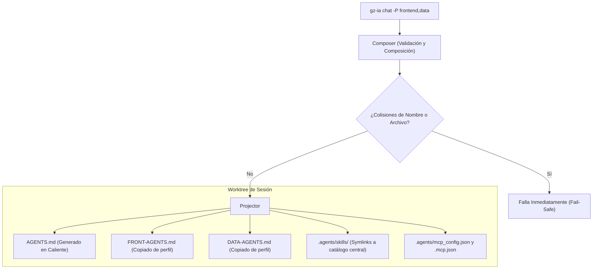

# Perfiles Agénticos y Catálogo de Skills

Los **Perfiles Agénticos** en Gountz IA (`gz-ia`) resuelven un problema recurrente al trabajar con agentes de terminal: evitar la proliferación desordenada de carpetas `.agents/`, skills duplicadas y archivos MCP flotando por múltiples repositorios.

Con `gz-ia`, tus reglas de dominio, MCP servers y skills viven en un **catálogo unificado y componible**, permitiendo activar exactamente lo que cada tarea necesita de manera limpia y sin ensuciar tu repositorio principal.

---

## 1. El Problema de la Duplicación

Al interactuar con agentes como Antigravity CLI (`agy`), Claude Code o similares, es habitual que cada proyecto termine con:
1. Una carpeta `.agents/skills` local con copias desactualizadas de las mismas skills (ej. Angular, Tailwind, PostgreSQL).
2. Reglas de arquitectura (`AGENTS.md`) gigantescas que mezclan directivas de frontend, backend y base de datos en un solo archivo monolítico.
3. Configuraciones de MCP redundantes copiadas y pegadas entre proyectos.

### La Solución de gz-ia
- **Repositorio Limpio (Zero-Pollution):** Tu rama principal nunca contiene `.agents/` temporales ni configuraciones efímeras.
- **Catálogo Centralizado o de Proyecto:** Las skills y perfiles pueden definirse a nivel usuario (`~/.config/gz-ia`) o a nivel proyecto (`.harness`).
- **Composición Dinámica:** Al iniciar una sesión con uno o más perfiles (`-P frontend,data`), `gz-ia` genera en el worktree aislado un `AGENTS.md` maestro que referencia a los archivos de dominio (`FRONT-AGENTS.md`, `DATA-AGENTS.md`) y proyecta enlaces simbólicos hacia las skills activas.

---

## 2. Anatomía de un Perfil Agéntico

Cada perfil se define dentro de su propio subdirectorio y contiene un archivo descriptor **`perfil.json`** (o `profile.json`):

```
~/.config/gz-ia/profiles/frontend/    (o .harness/profiles/frontend/)
├── perfil.json                       (descriptor obligatorio)
└── FRONT-AGENTS.md                   (reglas específicas de dominio)
```

### Esquema de `perfil.json`

```json
{
  "name": "frontend",
  "description": "Desarrollo Frontend Web (Angular, Tailwind, Testing E2E)",
  "agents_file": "FRONT-AGENTS.md",
  "skills": [
    "front-angular",
    "front-tailwind"
  ],
  "mcp_servers": {
    "playwright": {
      "command": "npx",
      "args": ["-y", "@executeautomation/playwright-mcp-server"]
    }
  },
  "env": {
    "NODE_ENV": "development"
  }
}
```

### Reglas Clave de Diseño

1. **Nombre Único y Detección Estricta de Colisiones:**
   El campo `name` es obligatorio. Si existe un perfil con el mismo nombre en el ámbito global (`~/.config/gz-ia/profiles/`) y en el ámbito del proyecto (`.harness/profiles/`), **`gz-ia` falla de inmediato con error** en lugar de sobreescribir silenciosamente. La colisión debe resolverse explícitamente para garantizar determinismo.

2. **Archivos de Dominio Específicos:**
   En lugar de que cada perfil contenga un genérico `AGENTS.md`, cada perfil define su archivo específico (ej. `FRONT-AGENTS.md`, `DATA-AGENTS.md`, `DEV-AGENTS.md`). Esto permite componer múltiples perfiles simultáneamente sin sobreescrituras destructivas.

---

## 3. Catálogo Unificado de Skills

Las skills se organizan en carpetas dentro del catálogo global (`~/.config/gz-ia/skills/`) o del proyecto (`.harness/skills/`):

```
~/.config/gz-ia/skills/
├── front-angular/
│   └── SKILL.md
├── front-tailwind/
│   └── SKILL.md
├── data-postgres/
│   └── SKILL.md
└── data-redis/
    └── SKILL.md
```

### Categorización por Prefijo
El sistema clasifica automáticamente las skills según su prefijo:
- `front-*` $\to$ Categoría `front`
- `data-*` $\to$ Categoría `data`
- `back-*` $\to$ Categoría `back`
- `devops-*` $\to$ Categoría `devops`

Cada skill contiene un `SKILL.md` con instrucciones especializadas para el agente de IA.

---

## 4. Proyección Dinámica en Tiempo de Ejecución

Cuando lanzas una sesión pasando uno o varios perfiles (por ejemplo `-P frontend,data`):

```bash
gz-ia chat -p agy -P frontend,data
```

El motor de `gz-ia` ejecuta los siguientes pasos dentro del worktree de la sesión (`.harness/worktrees/<id>`):



### 1. Generación de `AGENTS.md` Raíz
Se sintetiza un archivo maestro que orienta al agente hacia las directivas específicas de cada perfil activo:

```markdown
# Guía Operativa Agéntica (gz-ia)

> Archivo generado dinámicamente por gz-ia para la sesión de trabajo.

## Perfiles Activos
- **frontend**: Desarrollo Frontend Web (Angular, Tailwind, Testing E2E)
- **data**: Modelado y Persistencia de Datos

## Directivas y Reglas de Dominio
Lee atentamente las directivas específicas de cada dominio antes de ejecutar cambios:
- Directivas de Frontend: [FRONT-AGENTS.md](./FRONT-AGENTS.md)
- Directivas de Data: [DATA-AGENTS.md](./DATA-AGENTS.md)
```

### 2. Copia Aislada de Reglas de Dominio
Los archivos de directivas (`FRONT-AGENTS.md`, `DATA-AGENTS.md`) se copian al worktree de la sesión. Si el agente realiza notas o modificaciones durante su razonamiento, quedan confinadas en el worktree sin alterar la plantilla del catálogo central.

### 3. Enlaces Simbólicos de Skills
Las skills requeridas se proyectan en `.agents/skills/<skill-name>` mediante enlaces simbólicos hacia el catálogo central (`~/.config/gz-ia/skills/...`). Si el sistema de archivos no permite symlinks, `gz-ia` realiza una copia recursiva limpia como fallback.

### 4. Configuración MCP Agregada
Los servidores MCP definidos en los perfiles seleccionados se unifican y generan en `.agents/mcp_config.json` (para Antigravity) y `.mcp.json` (para Claude Code y agentes estándar).

---

## 5. Gestión desde la CLI

`gz-ia` provee el subcomando `profile` con paridad total:

### Listar Perfiles Disponibles
```bash
gz-ia profile list
```
Salida:
```text
NOMBRE            DESCRIPCIÓN                   SKILLS    AGENTS FILE         ÁMBITO  
frontend          Desarrollo Frontend React...  2 skills  FRONT-AGENTS.md     global  
data              Persistencia PostgreSQL...    1 skills  DATA-AGENTS.md      proyecto
```

### Ver Detalle de un Perfil
```bash
gz-ia profile show frontend
```
Salida:
```text
✧ Perfil Agéntico: frontend
────────────────────────────────────────────────────────────────────────
  Descripción:  Desarrollo Frontend Web (Angular, Tailwind)
  Ámbito:       global
  Ruta Base:    /home/usuario/.config/gz-ia/profiles/frontend
  Agents File:  FRONT-AGENTS.md (/home/usuario/.config/gz-ia/profiles/frontend/FRONT-AGENTS.md)
  Skills (2):   front-angular, front-tailwind
  MCP Servers:
    {
      "playwright": {
        "command": "npx",
        "args": ["-y", "@executeautomation/playwright-mcp-server"]
      }
    }
```

### Explorar el Catálogo de Skills
```bash
gz-ia profile skills
```
Salida:
```text
SKILL                   CATEGORÍA     ÁMBITO    DESCRIPCIÓN                   
front-angular           front         global    Guías y utilidades para Angular
front-tailwind          front         global    Reglas de diseño Tailwind CSS 
data-postgres           data          proyecto  Esquemas y buenas prácticas SQL
```

### Crear un Nuevo Perfil
```bash
# Crear en el proyecto actual (.harness/profiles/mobile)
gz-ia profile create mobile --desc "Desarrollo Móvil Flutter" --agents-file MOBILE-AGENTS.md

# Crear en el catálogo global del usuario (~/.config/gz-ia/profiles/mobile)
gz-ia profile create mobile --desc "Desarrollo Móvil Flutter" --agents-file MOBILE-AGENTS.md --global
```

### Obtener la Ruta para Scripting de Shell
```bash
# Ruta de un perfil específico
cd $(gz-ia profile path frontend)

# Ruta del catálogo de perfiles del proyecto
cd $(gz-ia profile path)
```

---

## 6. Selección Interactiva en la TUI

Al iniciar un chat desde la TUI interactiva (`gz-ia` o `gz-ia start`), el sistema detecta si existen perfiles disponibles en el entorno. Tras seleccionar el agente y el nivel de permisos, se despliega una pantalla de selección múltiple con casillas de verificación:

```text
◆ Perfiles Agénticos a activar (Opcional):
Espacio para seleccionar/deseleccionar perfiles. Enter para continuar.

[x] frontend (global, 2 skills) — Desarrollo Frontend Web
[ ] data (proyecto, 1 skills) — Persistencia de Datos
```

Al presionar `Enter`, los perfiles seleccionados se componen y se proyectan automáticamente en el espacio de trabajo del chat.

---

## 7. Ecosistema Global de Tooling Modular (`toolkits/`)

Además de los perfiles `perfil.json`, `gz-ia` soporta un sistema modular de composición de herramientas de IA en `~/.config/gz-ia/tooling/`.

### Estructura de `tooling/`

```text
~/.config/gz-ia/tooling/
├── config.json
└── toolkits/
    ├── toolkit-rn/
    │   ├── AGENTS.md
    │   ├── rules/
    │   │   └── mobile-arch.md
    │   ├── skills/
    │   │   └── react-native-bridge/
    │   │       └── SKILL.md
    │   └── tools.json
    └── toolkit-common/
        └── rules/
            └── clean-code.md
```

### Configuración en `tooling/config.json`

```json
{
  "version": 1,
  "perfiles": [
    {
      "name": "Programador React Native",
      "description": "Desarrollo móvil y puente nativo",
      "toolkits": ["toolkit-rn", "toolkit-common"]
    }
  ]
}
```

### El Microkernel Orchy como Servidor MCP Propio

En lugar de requerir que el usuario configure servidores MCP externos manualmente, `gz-ia` actúa como su propio servidor MCP:
1. Al crear el worktree de la sesión, `gz-ia` genera `.mcp.json` y `.agents/mcp_config.json` apuntando a:
   ```json
   {
     "mcpServers": {
       "gz-ia": {
         "command": "gz-ia",
         "args": ["mcp", "--session", "<session-id>"]
       }
     }
   }
   ```
2. Cuando el agente (`agy`, `claude`) ejecuta una llamada de herramienta, `gz-ia mcp` arranca el microkernel Orchy, monta las herramientas declaradas en los toolkits activos y las baterías seguras (`worktree_read`) protegidas por Circuit Breaker.

