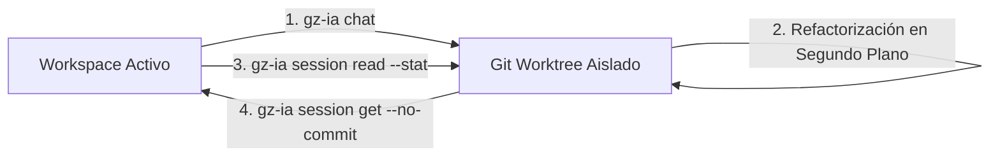

# Flujos de Trabajo del Mundo Real

Esta guía presenta cuatro escenarios operativos cotidianos en equipos de desarrollo profesionales, demostrando cómo combinar las capacidades de aislamiento en Git Worktrees, telemetría y ejecución agéntica de `gz-ia`.

---

## Escenario 1: Refactorización Aislada y Fusión Segura

En proyectos en producción, permitir que un agente de IA modifique directamente la base de código activa conlleva riesgos de regresiones o conflictos con ramas de trabajo en curso. Con `gz-ia`, la refactorización ocurre dentro de un worktree desacoplado.



### Paso 1: Lanzar la sesión de refactorización

Iniciamos una sesión supervisada con Google Antigravity delegando el objetivo inicial:

```bash
gz-ia chat -p agy -m supervised -i "Refactorizar capa de persistencia para desacoplar consultas SQL y usar repositorio genérico"
```

El harness asigna automáticamente un ID de sesión (ejemplo: `a8f102c4`) y monta el worktree en `.harness/worktrees/a8f102c4`. Tu directorio principal permanece 100% inalterado.

### Paso 2: Auditar el avance sin tocar el código base

Mientras el agente trabaja, puedes abrir otra pestaña de terminal y verificar qué archivos ha modificado o creado:

```bash
# Inspección no invasiva del resumen estadístico
gz-ia session read a8f102c4 --stat
```

**Salida de ejemplo:**

```text
 internal/repository/user_repo.go    | 74 ++++++++++++++++++++++++++-----------
 internal/repository/order_repo.go   | 62 ++++++++++++++++++++++---------
 internal/service/order_service.go   | 18 ++++-----
 3 files changed, 102 insertions(+), 52 deletions(-)
```

Si deseas ver el diff unificado completo antes de proceder:

```bash
gz-ia session diff a8f102c4
```

### Paso 3: Traer e integrar cambios al workspace activo

Una vez confirmada la calidad del trabajo del agente, traemos los cambios al workspace principal en modo *staging* para dar el visto bueno final:

```bash
gz-ia session get a8f102c4 --no-commit
```

**Salida en consola:**

```text
✓ Cambios del worktree traídos e integrados con éxito para la sesión 'a8f102c4'.
Archivos integrados:
  • internal/repository/user_repo.go
  • internal/repository/order_repo.go
  • internal/service/order_service.go
Nota: Los cambios quedaron preparados en el stage sin comitear (--no-commit).
```

Ahora puedes ejecutar tu suite de pruebas local (`go test ./...`) y realizar el commit definitivo con la autoría y mensaje que prefieras.

---

## Escenario 2: Debugging Autónomo con Claude Code

Cuando un error es intermitente o requiere explorar hipótesis complejas (como condiciones de carrera en tests de concurrencia), delegar la investigación a un agente autónomo ahorra tiempo crítico de ingeniería.

```bash
gz-ia chat -p claude -m autonomous -i "Localizar y corregir condición de carrera en pruebas de workers concurrentes (internal/worker/pool_test.go)"
```

### Beneficios del Modo Autónomo en Worktree
- **Auto-Aprobación Sin Riesgos:** Claude Code ejecuta tests con `-race`, inserta mutexes y prueba alternativas sin detenerse a pedir confirmación para cada comando, pero **únicamente** dentro del worktree de la sesión.
- **Tu terminal queda libre:** Puedes continuar programando en tus archivos locales mientras el agente itera en su entorno aislado.

---

## Escenario 3: Monitoreo Forense en Tiempo Real y Auditoría de Costos

La arquitectura de observabilidad de `gz-ia` registra cada llamada a herramientas, etapas del razonamiento y consumo de tokens en archivos NDJSON (`transcript.jsonl`).

### Streaming en vivo de eventos

En una segunda terminal o panel dividido de tmux, sigue en directo el razonamiento y las acciones del agente:

```bash
# Streaming reactivo de logs estructurados
gz-ia session logs a8f102c4 -f
```

**Salida visual en streaming:**

```text
[00:32:10] [orchestrator] [READ]    Leyendo internal/worker/pool.go (status: OK)
[00:32:14] [orchestrator] [PENDING] Ejecutando: go test -race -run TestWorkerPool ./internal/worker (status: null)
[00:32:16] [orchestrator] [FINISH]  Ejecución finalizada con error detectado (status: FAILED)
[00:32:20] [orchestrator] [PENDING] Aplicando sincronización con sync.RWMutex en pool.go (status: null)
```

### Auditoría de consumo, tokens y costos

Una vez que la sesión finaliza, puedes auditar las métricas exactas y telemetría de la sesión:

```bash
gz-ia session metrics a8f102c4
```

**Reporte generado:**

```text
✦ Métricas de Sesión: a8f102c4
────────────────────────────────────────
  Duración Total:     1m 48s
  Pasos Ejecutados:   14 pasos
  Herramientas:       view_file (6), run_command (5), replace_file_content (3)

Tokens Consumidos:
  • Prompt Tokens:      34,210
  • Completion Tokens:   3,840
  • Total Tokens:       38,050
  • Costo Estimado:     $0.052 USD
```

Si necesitas exportar estos datos a sistemas de analítica externa, utiliza la bandera `--json`:

```bash
gz-ia session metrics a8f102c4 --json > session-metrics.json
```

---

## Escenario 4: Automatización y Scripting en Shell

El comando `gz-ia session path <id>` devuelve la ruta física absoluta del worktree aislado. Esto permite componer scripts bash para validaciones continuas, linters o integración continua (CI) local.

### Script de validación automatizada

Crea un script ejecutable (por ejemplo `validate-session.sh`):

```bash
#!/usr/bin/env bash
set -euo pipefail

SESSION_ID="${1:?Debes proporcionar el ID de la sesión}"

echo "==> Obteniendo ruta del worktree de la sesión ${SESSION_ID}..."
WORKTREE_PATH=$(gz-ia session path "${SESSION_ID}")

echo "==> Worktree localizado en: ${WORKTREE_PATH}"

# Ingresar al directorio del worktree
cd "${WORKTREE_PATH}"

echo "==> Ejecutando suite de validación en el entorno aislado..."
if go test -race ./... && golangci-lint run; then
    echo "✓ Todas las pruebas pasaron satisfactoriamente en el worktree."
    echo "==> Fusionando cambios al workspace activo..."
    gz-ia session get "${SESSION_ID}" --squash
else
    echo "✗ Las pruebas fallaron en el worktree. No se integrarán los cambios."
    exit 1
fi
```

### Ejecución

```bash
chmod +x validate-session.sh
./validate-session.sh a8f102c4
```

Este flujo garantiza que únicamente código que pase el 100% de tus baterías de pruebas automáticas sea promocionado al árbol principal de trabajo.
