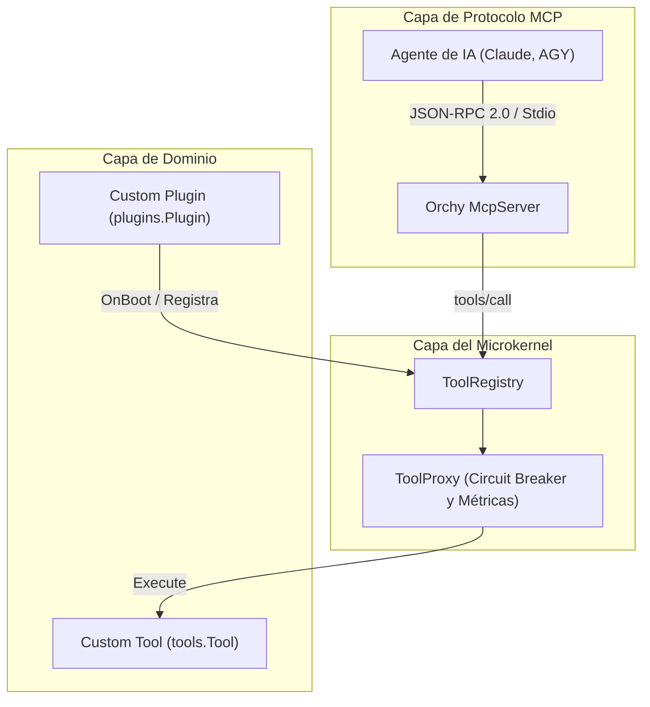

# Creación de Plugins y Herramientas en Orchy

Esta guía proporciona un tutorial práctico paso a paso para desarrolladores en Go que deseen extender el microkernel **Orchy** mediante plugins modulares y herramientas (`tools.Tool`) personalizadas protegidas por Circuit Breaker y expuestas automáticamente vía **Model Context Protocol (MCP)**.

---

## Arquitectura de una Extensión en Orchy

Cualquier capacidad que desees brindar a agentes de IA (como `agy`, `claude` u `opencode`) dentro de Orchy sigue un modelo de tres capas:



1. **Plugin (`plugins.Plugin`):** Gestiona el ciclo de vida, la configuración y el registro en el arranque (`OnBoot`) y apagado (`OnShutdown`).
2. **Herramienta (`tools.Tool`):** Define el nombre, la descripción semántica, el esquema JSON (`ToolSchema`) y la lógica de ejecución `Execute(ctx, input)`.
3. **Proxy de Resiliencia (`ToolProxy`):** Envuelve la herramienta con un Circuit Breaker, timeout y métricas de latencia de forma transparente.

---

## 1. Implementación de una Herramienta (`tools.Tool`)

Vamos a crear una herramienta de ejemplo llamada `database_query` que permite a los agentes consultar información de solo lectura en una base de datos interna.

### Definición de Tipos y Esquema

```go
package database

import (
	"context"
	"encoding/json"
	"errors"
	"fmt"

	"gz-ia/packages/orchy/tools"
)

// QueryInput define los parámetros requeridos por la herramienta.
type QueryInput struct {
	Table string `json:"table"`
	Limit int    `json:"limit,omitempty"`
}

// DatabaseQueryTool implementa la interfaz tools.Tool.
type DatabaseQueryTool struct {
	dbConn *DatabaseConnection // Tu cliente de persistencia
}

func NewDatabaseQueryTool(conn *DatabaseConnection) *DatabaseQueryTool {
	return &DatabaseQueryTool{dbConn: conn}
}

// Name retorna el identificador de la herramienta invocado en MCP tools/call.
func (t *DatabaseQueryTool) Name() string {
	return "database_query"
}

// Description explica a los modelos de lenguaje cuándo y cómo utilizar la herramienta.
func (t *DatabaseQueryTool) Description() string {
	return "Ejecuta consultas de solo lectura contra tablas del sistema interno para obtener métricas operativas."
}

// Schema describe el contrato de entrada con JSON Schema estándar.
func (t *DatabaseQueryTool) Schema() tools.ToolSchema {
	return tools.ToolSchema{
		Kind:        "object",
		Type:        "object",
		Description: "Parámetros para consultar tablas de base de datos.",
		Properties: map[string]any{
			"table": map[string]any{
				"type":        "string",
				"description": "Nombre de la tabla a inspeccionar (ej: 'users', 'events').",
			},
			"limit": map[string]any{
				"type":        "integer",
				"description": "Número máximo de filas a retornar (por defecto 10).",
			},
		},
		Required: []string{"table"},
	}
}

// Execute ejecuta la operación con soporte de cancelación de contexto.
func (t *DatabaseQueryTool) Execute(ctx context.Context, input any) (any, error) {
	// 1. Decodificar la entrada JSON
	var params QueryInput
	data, err := json.Marshal(input)
	if err != nil {
		return nil, fmt.Errorf("error al serializar input: %w", err)
	}
	if err := json.Unmarshal(data, &params); err != nil {
		return nil, fmt.Errorf("parámetros inválidos para database_query: %w", err)
	}

	if params.Table == "" {
		return nil, errors.New("el campo 'table' es obligatorio")
	}
	if params.Limit <= 0 {
		params.Limit = 10
	}

	// 2. Ejecutar la consulta respetando ctx
	rows, err := t.dbConn.QueryReadOnly(ctx, params.Table, params.Limit)
	if err != nil {
		return nil, fmt.Errorf("fallo en consulta a tabla %q: %w", params.Table, err)
	}

	return map[string]any{
		"table": params.Table,
		"count": len(rows),
		"rows":  rows,
	}, nil
}
```

---

## 2. Creación del Plugin (`plugins.Plugin`) y Registro con Circuit Breaker

Creamos un plugin que instancie la herramienta y la registre dentro del `ToolRegistry` del Kernel durante la fase `OnBoot`, configurando su **Circuit Breaker**:

```go
package database

import (
	"fmt"
	"time"

	"gz-ia/packages/orchy/core"
	"gz-ia/packages/orchy/plugins"
	"gz-ia/packages/orchy/tools"
)

// DatabasePlugin gestiona el ciclo de vida de la conexión y herramientas de datos.
type DatabasePlugin struct {
	plugins.BasePlugin
	conn *DatabaseConnection
}

func NewDatabasePlugin(dsn string) *DatabasePlugin {
	return &DatabasePlugin{
		BasePlugin: plugins.BasePlugin{
			PluginName:    "core.database",
			PluginVersion: "1.0.0",
		},
		conn: NewDatabaseConnection(dsn),
	}
}

func (p *DatabasePlugin) Name() string {
	return "core.database"
}

func (p *DatabasePlugin) Version() string {
	return "1.0.0"
}

// OnBoot se ejecuta durante el inicio del Kernel de Orchy.
func (p *DatabasePlugin) OnBoot(ctx *core.KernelContext) error {
	// 1. Conectar a los recursos del plugin
	if err := p.conn.Connect(); err != nil {
		return fmt.Errorf("no se pudo conectar a la base de datos: %w", err)
	}

	// 2. Instanciar la herramienta
	queryTool := NewDatabaseQueryTool(p.conn)

	// 3. Registrar con opciones de Circuit Breaker y Timeout
	toolOptions := tools.ToolProxyOptions{
		MaxConsecutiveFailures: 3,                // Abre el circuito si falla 3 veces seguidas
		Timeout:                10 * time.Second, // Cancela ejecuciones que excedan 10 segundos
	}

	_, err := ctx.Tools().Register(queryTool, toolOptions)
	if err != nil {
		return fmt.Errorf("error al registrar database_query: %w", err)
	}

	return nil
}

// OnShutdown libera recursos al detener el microkernel.
func (p *DatabasePlugin) OnShutdown(ctx *core.KernelContext) error {
	if p.conn != nil {
		return p.conn.Close()
	}
	return nil
}
```

::: tip ¿Cómo funciona el Circuit Breaker de Orchy?
El `ToolProxy` supervisa el estado de salud de la herramienta en tiempo real:
- **`HEALTHY` (Saludable):** Operación normal.
- **`DEGRADED` (Degradado):** Al acumular 2 fallos consecutivos. Permite seguir invocando pero alerta en métricas.
- **`DEAD` (Circuito Abierto):** Si alcanza `MaxConsecutiveFailures` (3), el circuito se abre de inmediato. Las llamadas subsiguientes se rechazan instantáneamente sin sobrecargar la infraestructura hasta que se invoque `ResetCircuitBreaker()`.
- **Panic Recovery:** Cualquier `panic()` ocurrido dentro de `Execute()` es capturado automáticamente y transformado en error, impidiendo que el proceso colapse.
:::

---

## 3. Exposición Automática al Servidor MCP JSON-RPC 2.0 por Stdio

Una de las mayores virtudes de Orchy es que **no requiere ningún código extra** para exponer las herramientas a clientes MCP. Una vez que el plugin registra la herramienta en el Kernel, el servidor MCP la cataloga e inspecciona dinámicamente.

### Servidor de Entrada (`main.go`)

```go
package main

import (
	"log"
	"os"

	"gz-ia/packages/orchy"
	"mi-modulo/database"
)

func main() {
	// 1. Inicializar el Microkernel
	kernel := orchy.NewKernel()

	// 2. Registrar el Plugin en el contexto del Kernel
	dbPlugin := database.NewDatabasePlugin("postgres://localhost:5432/app")
	if err := kernel.GetContext().Plugins().Register(dbPlugin); err != nil {
		log.Fatalf("Fallo al registrar plugin: %v", err)
	}

	// 3. Arrancar el Microkernel (ejecuta OnBoot de todos los plugins)
	if err := kernel.Boot(); err != nil {
		log.Fatalf("Error durante el arranque del kernel: %v", err)
	}
	defer kernel.Shutdown()

	// 4. Instanciar e iniciar el servidor MCP sobre Stdio
	mcpServer := orchy.NewMcpServer(kernel, os.Stdin, os.Stdout)
	if err := mcpServer.Serve(); err != nil {
		log.Fatalf("Error en servidor MCP: %v", err)
	}
}
```

---

## 4. Invocación desde Agentes (`agy`, `claude`)

Cuando configuras tu agente de IA para usar este servidor MCP (mediante su archivo `mcpServers` en config), el agente realiza automáticamente el protocolo de negociación JSON-RPC:

### Descubrimiento (`tools/list`)

El agente solicita la lista de capacidades:

```json
--> {"jsonrpc": "2.0", "id": 1, "method": "tools/list"}
```

El servidor Orchy responde automáticamente con el esquema de tu herramienta:

```json
<-- {
  "jsonrpc": "2.0",
  "id": 1,
  "result": {
    "tools": [
      {
        "name": "database_query",
        "description": "Ejecuta consultas de solo lectura contra tablas del sistema interno para obtener métricas operativas.",
        "inputSchema": {
          "type": "object",
          "properties": {
            "table": {"type": "string", "description": "Nombre de la tabla a inspeccionar (ej: 'users', 'events')."},
            "limit": {"type": "integer", "description": "Número máximo de filas a retornar (por defecto 10)."}
          },
          "required": ["table"]
        }
      }
    ]
  }
}
```

### Ejecución (`tools/call`)

Cuando el agente decide invocar la herramienta:

```json
--> {
  "jsonrpc": "2.0",
  "id": 2,
  "method": "tools/call",
  "params": {
    "name": "database_query",
    "arguments": {
      "table": "users",
      "limit": 2
    }
  }
}
```

Orchy ejecuta la llamada bajo el Circuit Breaker de 10s y retorna el resultado estructurado:

```json
<-- {
  "jsonrpc": "2.0",
  "id": 2,
  "result": {
    "content": [
      {
        "type": "text",
        "text": "{\"count\":2,\"rows\":[{\"id\":1,\"name\":\"Alice\"},{\"id\":2,\"name\":\"Bob\"}],\"table\":\"users\"}"
      }
    ]
  }
}
```

Con este patrón, cualquier capacidad de tu infraestructura en Go puede integrarse de forma limpia, resiliente y estándar con los agentes de IA de última generación.
