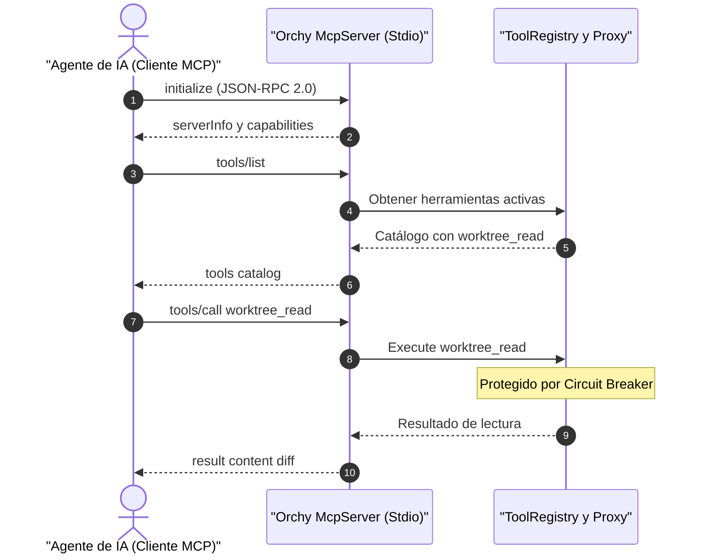

# Servidor MCP Nativo (Model Context Protocol)

El paquete `packages/orchy/mcp` implementa un servidor conforme a la especificación oficial de **Model Context Protocol (MCP)** de Anthropic, comunicándose a través de flujos estándar `io.Reader` y `io.Writer` (típicamente `os.Stdin` y `os.Stdout`) utilizando el estándar **JSON-RPC 2.0**.

---

## ¿Por qué MCP Nativo en gz-ia?

El protocolo MCP permite a cualquier modelo de lenguaje o agente de terminal (`claude code`, `agy`, etc.) descubrir e invocar herramientas del sistema de forma estandarizada.

Al integrar el servidor MCP directamente dentro del microkernel Orchy:
1. **Cero Dependencias Externas:** No se requiere instalar Node.js ni Python para levantar servidores MCP auxiliares.
2. **Protección por Circuit Breaker:** Cada llamada a una herramienta MCP pasa por el `ToolProxy` de Orchy, previniendo cuelgues si una herramienta falla.
3. **Control Centralizado:** Permite exponer herramientas seguras de worktree (`worktree_read`) para que el agente inspeccione su avance, manteniendo la integración (`get`) bajo control humano en el CLI.

---

## Protocolo y Métodos Soportados

El servidor MCP procesa los siguientes métodos del protocolo estándar:



---

## Generador de Manifiestos (`ManifestGenerator`)

Para aquellos agentes o contextos donde se requiere inyectar la lista de herramientas disponibles en el prompt inicial del sistema, Orchy proporciona el `mcp.ManifestGenerator` (`packages/orchy/mcp/manifest.go`):

```go
generator := orchy.NewManifestGenerator(kernel.GetContext().Tools)

// Genera un bloque Markdown estructurado listo para incluir en prompts del sistema
promptManifest := generator.GenerateMarkdownManifest()
```

El manifiesto resultante incluye:
- Nombre y propósito de cada herramienta.
- Esquema JSON de parámetros requeridos y opcionales.
- Estado actual de salud del Circuit Breaker (`HEALTHY`, `DEGRADED`).
- Ejemplos de invocación.

---

## Ejecución del Servidor MCP

Para instanciar e iniciar el servidor MCP sobre Stdio:

```go
package main

import (
    "os"
    "gz-ia/packages/orchy"
)

func main() {
    kernel := orchy.NewKernel()
    _ = kernel.Boot()
    defer kernel.Shutdown()

    // Crear y arrancar el servidor MCP vinculado a stdin/stdout
    mcpServer := orchy.NewMcpServer(kernel, os.Stdin, os.Stdout)
    if err := mcpServer.Serve(); err != nil {
        panic(err)
    }
}
```
