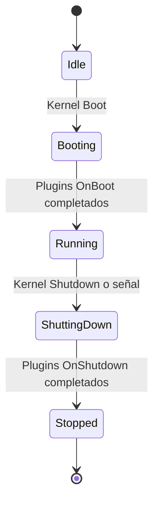
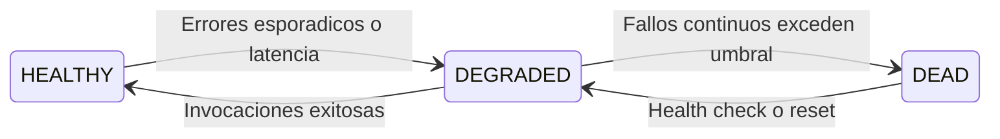

# Microkernel Orchy: Conceptos y Filosofía

**Orchy** (`packages/orchy`) es el microkernel modular, desacoplado y extensible embebido dentro de `gz-ia`.

Inspirado en la filosofía Unix y los principios de microkernel de sistemas operativos, Orchy proporciona un entorno de ejecución resiliente enfocado en el **aislamiento de fallos (Fault Isolation)**, supervisión continua de salud y protocolos estrictos de comunicación intermodular expuestos automáticamente vía **Model Context Protocol (MCP)**.

---

## Filosofía: El "Kernel Honesto" (Honest Kernel)

En los sistemas tradicionales de agentes de IA, los errores de herramientas externas suelen ser silenciados, capturados genéricamente o falseados como respuestas vacías. Esto provoca alucinaciones en el modelo de lenguaje, que asume que una operación se ejecutó con éxito cuando en realidad falló silenciosamente.

Orchy se basa en el principio del **Kernel Honesto**:
- **Cero Falsos Positivos:** Si una herramienta falla, el kernel reporta el error exacto con su traza y estado de salud.
- **Transparencia Radical:** El agente recibe información fidedigna sobre la capacidad o degradación del sistema.
- **Aislamiento de Fallos:** El colapso de un plugin o herramienta externa nunca debe comprometer la estabilidad del kernel ni de otros servicios.

> [!NOTE] Aislamiento de Fallos vs Seguridad de Sistema Operativo
> El aislamiento provisto por Orchy es de **resiliencia de software y contención de fallos en memoria**: captura excepciones no controladas (`recover()` ante panics) y aísla fallos repetitivos mediante Circuit Breakers para evitar que el proceso del kernel o el servidor MCP colapsen.
> **No es un sandbox de sistema operativo:** las herramientas ejecutadas (scripts locales o comandos de `tools.json`) se ejecutan con los mismos privilegios del usuario del sistema en su máquina.

---

## Ciclo de Vida del Microkernel

El microkernel implementa una máquina de estados estricta para garantizar inicialización ordenada y limpieza segura de recursos:



### Estados del Kernel (`KernelState`)
1. **`KernelStateIdle`:** Estado inicial. Se registran plugins y servicios en el contenedor.
2. **`KernelStateBooting`:** El kernel ejecuta en orden de dependencia el método `OnBoot(ctx)` de cada plugin pasando el contexto de ejecución.
3. **`KernelStateRunning`:** Todos los servicios y herramientas están listos para recibir llamadas y procesar eventos.
4. **`KernelStateShuttingDown`:** Se rechazan nuevas invocaciones y se ejecuta `OnShutdown(ctx)` en orden inverso de registro.
5. **`KernelStateStopped`:** Recursos liberados y buses cerrados limpiamente.

---

## Contexto Unificado (`KernelContext`)

Cuando un plugin o herramienta se ejecuta, recibe un puntero a `core.KernelContext` (`packages/orchy/core/context.go`), el cual centraliza el acceso a todos los subsistemas mediante métodos tipados:

```go
type KernelContext struct {
    services *ServiceContainer // Contenedor IoC de inyección de dependencias
    eventBus *events.EventBus  // Bus tipado de eventos Pub/Sub y Request/Response
    tools    *tools.ToolRegistry // Registro de herramientas con Circuit Breaker
}
```

### Métodos de Acceso y Operación:
- `ctx.Tools()`: Retorna el `*ToolRegistry` para registrar o inspeccionar herramientas.
- `ctx.Services()`: Retorna el `*ServiceContainer` para resolución de servicios.
- `ctx.EventBus()`: Retorna el `*EventBus` para Pub/Sub y RPC.
- `ctx.RegisterTool(tool, opts...)`: Registra directamente una herramienta protegida por Circuit Breaker.
- `ctx.RegisterService(name, svc)`: Publica una dependencia en el contenedor IoC.
- `ctx.Emit(ctx, event, payload)`: Emite un evento en el bus.
- `ctx.On(event, handler)`: Se suscribe a un tópico reactivo.

---

## Circuit Breaker de 3 Estados para Herramientas

Cada herramienta registrada en el `ToolRegistry` es envuelta automáticamente por un proxy de supervisión (`tools.ToolProxy` (`packages/orchy/tools/proxy.go`)) que implementa un patrón **Circuit Breaker**:



### Los 3 Estados de Salud (`ToolStatus`)

1. **`ToolStatusHealthy` (`HEALTHY`):**
   - La herramienta opera con normalidad dentro de los límites esperados de latencia y tasa de error nula (0% de fallos).
   - Las solicitudes del agente son despachadas de inmediato.
2. **`ToolStatusDegraded` (`DEGRADED`):**
   - La herramienta ha presentado fallos intermitentes o latencia elevada.
   - Las llamadas continúan permitiéndose, pero se emite una advertencia estructurada al agente y al logger para que considere estrategias alternativas.
3. **`ToolStatusDead` (`DEAD`):**
   - El circuito se abre tras exceder el umbral de fallos consecutivos (`MaxConsecutiveFailures`).
   - Las solicitudes son rechazadas inmediatamente (*fail-fast*) sin esperar tiempos muertos de red o timeouts, notificando al agente que la herramienta no está disponible temporalmente.

---

## Ejemplo: Registro de una Herramienta con Orchy

```go
package main

import (
    "context"
    "fmt"
    "gz-ia/packages/orchy"
)

func main() {
    kernel := orchy.NewKernel()

    // Registrar una herramienta con Circuit Breaker en el kernel
    _, err := kernel.RegisterTool(orchy.NewTool(
        "calcular_hash",
        "Calcula el hash SHA-256 de una cadena",
        orchy.ToolSchema{
            Type: "object",
            Properties: map[string]any{
                "input": map[string]any{"type": "string"},
            },
            Required: []string{"input"},
        },
        func(ctx context.Context, input any) (any, error) {
            // Lógica de ejecución
            return map[string]string{"hash": "e3b0c44298fc1c149afbf4c8996fb92427ae41e4649b934ca495991b7852b855"}, nil
        },
    ))
    if err != nil {
        panic(err)
    }

    ctx := context.Background()
    if err := kernel.Boot(ctx); err != nil {
        panic(err)
    }
    defer kernel.Shutdown(ctx)

    fmt.Println("Orchy Kernel corriendo con herramientas listas.")
}
```
