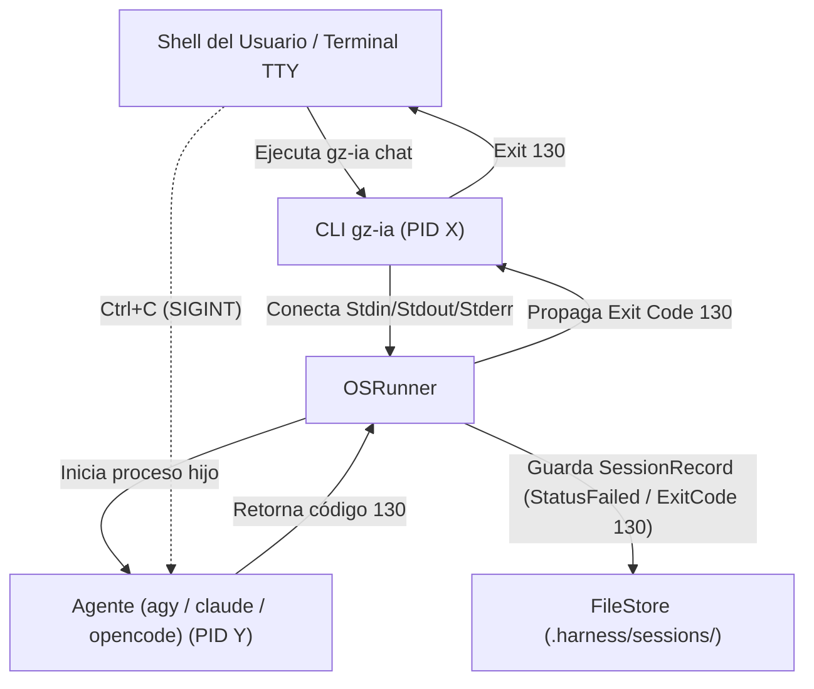

# Códigos de Salida (Exit Codes) y Manejo de Errores

Este documento describe la especificación formal de los **códigos de salida POSIX**, la propagación de señales y las estrategias de resolución de errores implementadas en `gz-ia`.

---

## 1. Tabla Formal de Códigos de Salida

La CLI de `gz-ia` sigue rigurosamente las convenciones de códigos de salida del estándar POSIX y el diseño de utilidades Unix:

| Código de Salida | Nombre Formal | Significado y Contexto de Disparo |
| :---: | :--- | :--- |
| `0` | **Success** | Ejecución exitosa. Para comandos de sesión (`chat`, `resume`), indica que el agente o el ejecutable subyacente completó su ciclo de vida normalmente con código `0`. |
| `1` | **Error General / Failure** | Fallo en tiempo de ejecución: error interno, ejecutable agéntico ausente en `$PATH`, conflicto irresoluble en Git merge, sesión inexistente o error en operaciones de I/O en disco. |
| `2` | **Argument / Syntax Error** | Banderas o subcomandos no reconocidos, argumentos posicionales faltantes o sintaxis inválida al invocar la CLI (manejado por el motor de comandos Cobra). |
| `130` | **Script Terminated by Ctrl+C** | Señal POSIX `SIGINT` (128 + 2). El usuario canceló la sesión interactiva pulsando `Ctrl+C` en la terminal. El arnés intercepta la señal, registra el estado y lo propaga fielmente al shell padre. |
| `143` | **Terminated by SIGTERM** | Señal POSIX `SIGTERM` (128 + 15). El proceso fue terminado de forma ordenada mediante `gz-ia session kill <id>` o por un proceso supervisor externo antes de escalar a `SIGKILL`. |

---

## 2. Propagación de Señales POSIX y Ejecución Interactiva (TTY)

El runner interactivo del arnés (`OSRunner` (`internal/features/session/session.go`)) conecta de forma bidireccional los descriptores estándar del sistema operativo (`os.Stdin`, `os.Stdout`, `os.Stderr`).



### Proceso de Terminación Controlada (`session kill`)

Cuando un operador ejecuta `gz-ia session kill <id>`, la terminación se efectúa mediante `OSProcessKiller` (`internal/features/session/killer.go`):

1. **Sondeo de Liveness:** Envía señal `0` (`syscall.Signal(0)`) para comprobar si el proceso con el PID registrado sigue vivo.
2. **Señal SIGTERM Ordenada:** Envía `syscall.SIGTERM` permitiendo que el proceso flush buffers y cierre descriptores.
3. **Periodo de Gracia:** Espera `100ms`.
4. **Forzado con SIGKILL:** Si el proceso continúa activo tras el periodo de gracia, despacha `SIGKILL` forzado (`proc.Kill()`).
5. **Persistencia de Estado:** Actualiza el archivo `.harness/sessions/<id>.json` marcando el estado de la sesión como `killed`.

---

## 3. Matriz de Casos Comunes de Error y Resolución

La siguiente matriz detalla las excepciones más frecuentes, su causa raíz, la reacción de ingeniería del arnés y las acciones requeridas para subsanarlas:

| Mensaje de Error / Síntoma | Causa Raíz | Comportamiento del Arnés | Acción Requerida de Resolución |
| :--- | :--- | :--- | :--- |
| **`Directorio no es un repositorio Git`** | La sesión se inicia en una carpeta sin inicializar con Git (`.git` ausente o `git rev-parse --is-inside-work-tree != true`). | **Fallback transparente:** El proveedor de workspace no aborta; conmuta automáticamente a modo directo (`IsIsolated: false`, operando sobre el directorio actual). | Si se requiere aislamiento de trabajo en rama temporal, ejecutar `git init` y realizar al menos un commit inicial antes de lanzar la sesión. |
| **`ejecutable '<bin>' no encontrado en el PATH`** | El binario del driver agéntico configurado (`agy`, `claude`, `opencode`, `pi-agent`) no está instalado o no forma parte de `$PATH`. | Valida la disponibilidad mediante `LookPath()` antes de invocar el runner y despliega la sugerencia oficial de instalación provista por `driver.InstallHint()`. | Instalar el cliente CLI correspondiente según el proveedor:<br>• `agy`: Seguir la guía oficial de Antigravity.<br>• `claude`: `npm install -g @anthropic-ai/claude-code`<br>• `opencode`: `curl -fsSL https://opencode.ai/install \| bash`<br>• `pi-agent`: Instalar CLI según documentación oficial. |
| **`Conflicto en Git merge`** | Durante `gz-ia session merge <id>`, cambios concurrentes en la rama base colisionan con los commits generados por el agente en `harness/<id>`. | **Seguridad atómica de Git:** Git rechaza el merge sin sobreescribir código en el repo principal. El worktree de la sesión permanece intacto con su historial completo. | 1. Inspeccionar la ruta física del worktree con `gz-ia session path <id>`.<br>2. Resolver manualmente los conflictos en el worktree o usar `git merge --abort` en la rama base.<br>3. Reintentar con `gz-ia session merge <id> --squash`. |
| **`sesión '<id>' no encontrada`** | El archivo persistente `.harness/sessions/<id>.json` no existe en el directorio de trabajo activo ni en la raíz del proyecto. | La CLI interrumpe la operación retornando código de salida `1` y emitiendo un mensaje descriptivo en `os.Stderr`. | 1. Verificar los IDs de sesiones disponibles con `gz-ia session list`.<br>2. Comprobar si la sesión fue ejecutada en otro subdirectorio pasando el flag `-d <ruta>`. |
| **`Servidor de releases inaccesible`** | Falla de conectividad de red o indisponibilidad temporal al invocar `gz-ia update`. | El servicio actualizador consulta los endpoints de release; ante error de red o timeout, emite un mensaje descriptivo sin alterar el binario actual. | 1. Verificar la conexión a internet.<br>2. Si se utiliza un proxy, configurar `HTTP_PROXY` o `HTTPS_PROXY`. |
| **`Herramienta en estado DEAD por Circuit Breaker`** | Una herramienta o plugin de Orchy superó el umbral máximo de 5 fallos consecutivos de ejecución (`maxConsecutiveFailures >= 5`). | **Aislamiento de Fallos (Fault Tolerance):** El circuito interrumpe la invocación inmediata de la herramienta devolviendo un error sin voltear el proceso servidor MCP ni el microkernel. | 1. Subsanar la causa subyacente del error (ej. timeout de red, archivo no encontrado).<br>2. Invocar `ResetCircuitBreaker()` en el proxy de la herramienta para restablecer su estado a `HEALTHY`. |

---

## 4. Ejemplos de Salida en la Terminal

### Error por Ejecutable Ausente en PATH

```bash
$ gz-ia chat --provider claude
Error: el agente 'Claude Code (claude)' (claude) no está disponible en el PATH.
Instalación: npm install -g @anthropic-ai/claude-code
$ echo $?
1
```

### Error por Sintaxis o Banderas Desconocidas

```bash
$ gz-ia chat --invalid-flag
Error: unknown flag: --invalid-flag
$ echo $?
2
```

### Cancelación Interrumpida por el Usuario (`SIGINT`)

```bash
$ gz-ia chat
[?] Describa la tarea para el agente: ^C
$ echo $?
130
```

### Fallo por Circuit Breaker en Orchy MCP Server

```json
{
  "jsonrpc": "2.0",
  "id": 4,
  "error": {
    "code": -32603,
    "message": "[ToolProxy] circuit breaker tripped for tool \"workspace_commit\": status is DEAD after 5 consecutive failures"
  }
}
```
