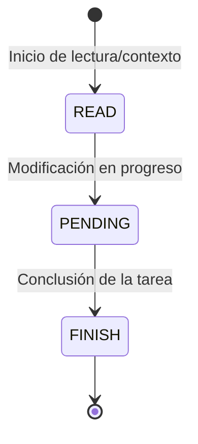

# Protocolo de Logger y Eventos

Esta sección especifica el estándar formal del protocolo de observabilidad y registro de eventos para `gz-ia`.

---

## Esquema JSON del Evento (`LogEvent`)

Cada registro en `.harness/sessions/<id>.events.jsonl` debe cumplir estrictamente con el siguiente esquema JSON:

```json
{
  "$schema": "http://json-schema.org/draft-07/schema#",
  "title": "LogEvent",
  "type": "object",
  "required": [
    "timestamp",
    "session_id",
    "action",
    "stage",
    "status",
    "agent"
  ],
  "properties": {
    "timestamp": {
      "type": "string",
      "format": "date-time",
      "description": "Estampa de tiempo RFC3339 en UTC."
    },
    "session_id": {
      "type": "string",
      "description": "Identificador único de la sesión."
    },
    "parent_session_id": {
      "type": "string",
      "description": "Identificador de la sesión padre si fue emitido por un subagente."
    },
    "action": {
      "type": "string",
      "description": "Descripción concisa de la acción o tarea en curso."
    },
    "stage": {
      "type": "string",
      "enum": ["READ", "PENDING", "FINISH"],
      "description": "Fase actual del ciclo de vida del evento."
    },
    "status": {
      "type": "string",
      "enum": ["OK", "FAILED"],
      "description": "Resultado de la etapa."
    },
    "agent": {
      "type": "string",
      "description": "Nombre o identificador del agente (ej. 'agy', 'claude')."
    },
    "role": {
      "type": "string",
      "description": "Rol funcional opcional del agente o subagente."
    },
    "duration_ms": {
      "type": "integer",
      "minimum": 0,
      "description": "Duración de la acción en milisegundos."
    },
    "error": {
      "type": "string",
      "description": "Mensaje de error detallado cuando status es FAILED."
    }
  }
}
```

---

## Ciclo de Transición de Etapas

El arnés valida las transiciones entre etapas:



### Reglas de Validación
1. **Transición Ordenada:** Un evento `FINISH` debe corresponder a una acción previamente iniciada en `READ` o `PENDING`.
2. **Registro de Fallos:** Si un evento finaliza con `status: "FAILED"`, el campo `error` no debe estar vacío.
3. **Milisegundos Positivos:** `duration_ms` debe ser un entero no negativo que represente el tiempo transcurrido de la etapa.
